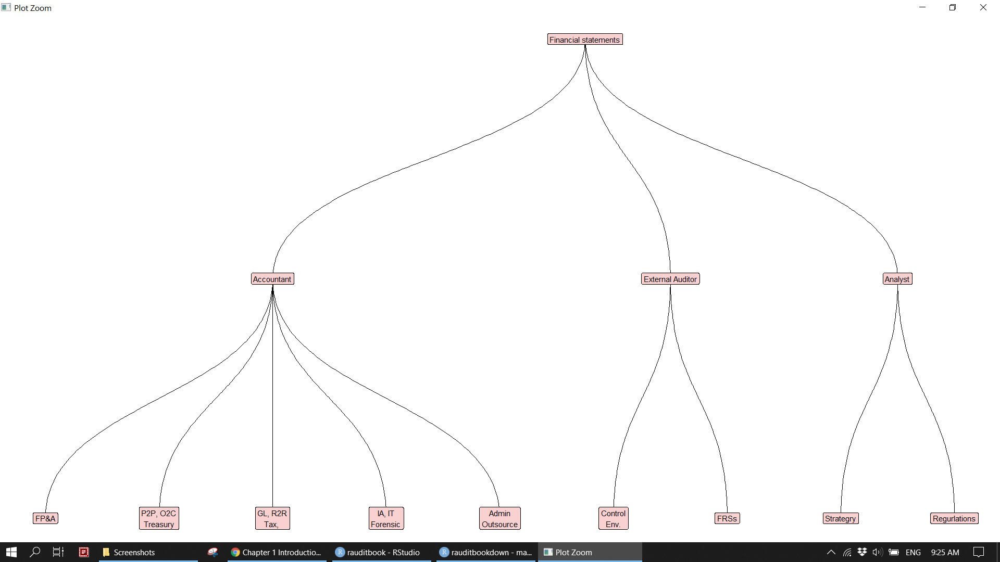

# Introduction

Financial statements is vital component of economic activities. The whole finance department is dedicated to prepare financial statements. Accounting functions can be broken down into Forecast Planning & Analysis (FP&A), General Ledger (GL), Record to Report (R2R), Procurement to Payment (P2P), Order to Cash (O2C), Treasury, Internal Audit, Forensic Accounting, and IT Audit (IA), Tax, Administration, Sectary, Outsource firms in accordance with ERP processes. External Auditors work under massive pressure to ensure that financial statements are presented in the basis of true and fair. Analysts typically evaluate financial statements and its ratios and metrics in the hope of a better investment opportunity. This book refers them as accounting professionals since their work is around financial statements. Financial statements could be affected by corporate strategy, internal control environment, FRSs adoption, relevant regulations, and others. However, this book only concerns financial statements data itself. 


```{r eval=FALSE}
df <- tibble::tribble(
  ~from,                            ~to,                          
  'Financial statements',   'Accountant',                    
  'Financial statements',   'External Auditor',              
  'Financial statements',   'Analyst',                       
  'Accountant',                    'FP&A',                          
  'Accountant',                    'P2P, O2C\nTreasury',       
  'Accountant',                    'GL, R2R\nTax, ',           
  'Accountant',                    'IA, IT\nForensic',         
  'Accountant',                    'Admin\nOutsource',           
  'External Auditor',              'Control\nEnv.',        
  'External Auditor',              'FRSs',                         
  'Analyst',                       'Strategry',                      
  'Analyst',                       'Regurlations',                 
  ) 

igraph::graph_from_data_frame(df) %>% 
  ggraph::ggraph(layout = 'dendrogram') + 
  ggraph::geom_edge_diagonal() +
  ggraph::geom_node_label(aes(label = name), fill = "#F9D1D1") +
  theme_void()
```


```{r}

```


Accounting professionals employ a a wide variety of data analytics tools. For instance, FP&A and GL extract data from TM1 and present the results in Excel. External Auditors utilize CAATs ranges from Excel, IDEA, ACL to Tableau, PowerBI, Qlik, and Alteryx over the course of auditing. Analysts build financial models via Excel VBA. As data goes bigger and problems become more complex, those GUI tools become increasingly challenging to work with and their limitations on the performance show up. It has been believed that computer programming languages like R and Python will be a ultimate tool for accounting professionals. Programming codes, text like, allow you to freely express yourself compared to the complicated formula of GUI tools. Business problems can be easily translated into codes in a sensible logical way in which accounting professionals approach them. What’s more, accounting professional can apply R and Python along with those GUI tools as preferred as all tools are integrated well. An obvious advantage to using programming languages is that free open source software, R and Python, have a large and growing global community which provide the ability to do both general and specialized tasks and solve any edge cases accounting professionals might face.    

Increasing focus on data analytics in recent years means that the ability to enhance the improvement of effectiveness and efficiency will be of great interest in practice. Current trends away from manual process and the rise of Robotic Process Automation (RPA) will likely result in greater requirements for accounting professionals in order to automatize repetitive work processes. More and more organizations recognize potential substantial value to be gained from the application of R and Python in corporate settings, and seek to understand better how to integrate with their exiting workflows. As matter of fact, this book is inspired by a meeting with one of our clients. But, the problem is that few accounting professionals really know how to do data analysis in R and Python. It is still considered by many as a IT thing. Given the pressing circumstances, they should be thinking about how to reflect R and Python in their work. This book presents a practical implementation of R for accounting professionals in this regard. 

As this book is intended to be more of a technical manual and targeted at technical practitioners, we aims to show how accounting professionals can achieve the improvement in efficiency and effectiveness using R and do not explain accounting concepts and codes in details. We assumes you are a chartered accountant who have a basic knowledge of computer programming languages. If you have never programmed before, you can get a better sense of it after read Chapter 2. We also provide some pointers for you to study further if there are better books to explain relevant concepts and codes. Our focus has been primarily on teaching data analysis of sales records and general ledger using R in a accounting related context. In order to cover as many key techniques as possible, we try not to repeat code and will do the same thing in different ways. As you read through the book, you will quickly grasp knowledge for the application of these techniques in your work and see benefit from it. That said, use cases and examples in the book will clearly point to the motivation of the analysis and usefulness of functions in practice. 

This book follows a clear flowchart of data analytics and science from [R4DS](https://r4ds.had.co.nz/). Common data analytics functions used by accounting professionals appear throughout the book. Such as `count`, `arrange`, `summarize`, `pivot_`, `recode`, `mutate`, `filter`, `slice`. From Chapter 2 onwards, this book takes the following structure:     
- Chapter 2 introduces R in a common structural way in which other computer programming languages has same components with slightly different implementation.         
- Chapter 3 and 4 analyze sales records from FP&A perspective. It demonstrate how to extract, transform and load (ETL) data from database and query the database via R and SQL interchangeably. It then proceeds to validate data, perform exploratory data analysis (EDA), and create report and dashboard.    
- Chapter 5 perform audit procedures on general ledger from external auditors points of view. It goes through a variety of technical options for different audit phases.     
- Chapter 6 looks at the various utility tools which would not fit very well elsewhere in the book, and yet be important enough to mention.    

This book is licensed under the Creative Commons Attribution-NonCommercial-ShareAlike 4.0 International License. [The code contained in this book](https://github.com/stewartli/rauditbookdown) is available under the MIT license. If you acknowledge the source and use the contents or any examples of this book for teaching purposes, you don’t need to ask the permission to do so.

My thank to various fantastic packages authors in R and Python community whose work allows me to write this book. I would like to thank various people who helped us make this book better by reading early drafts. 


