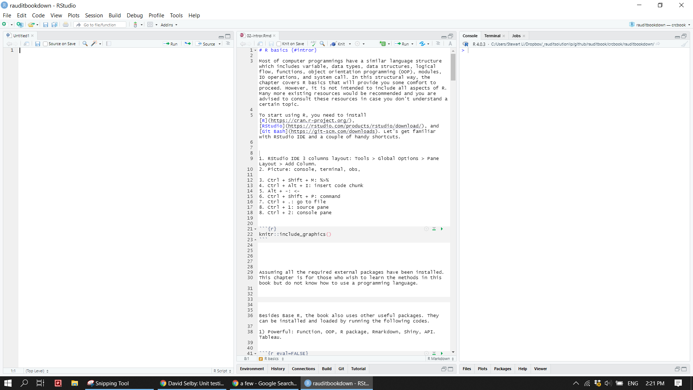
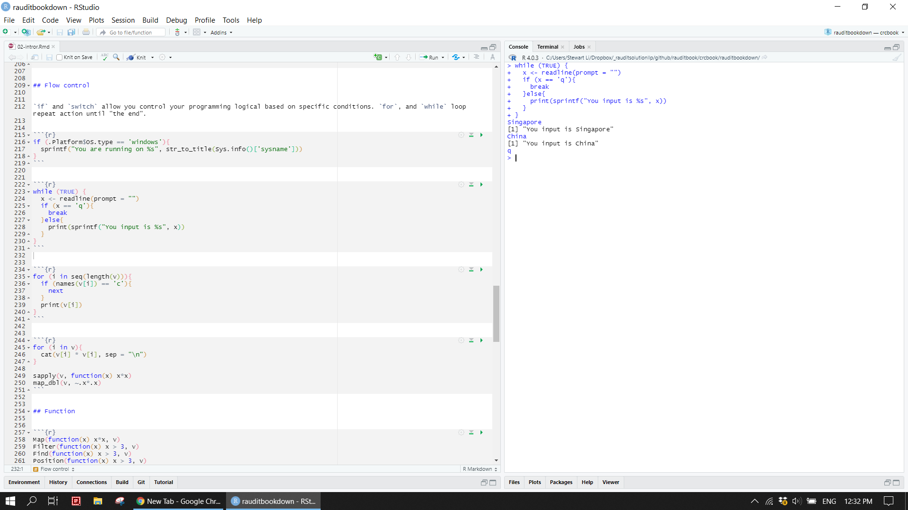
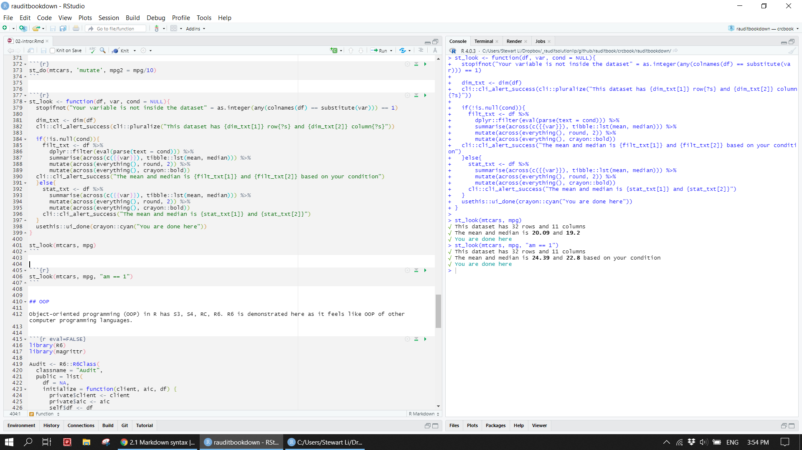
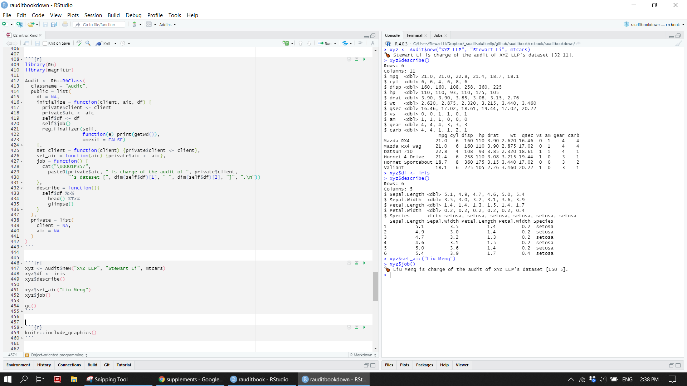
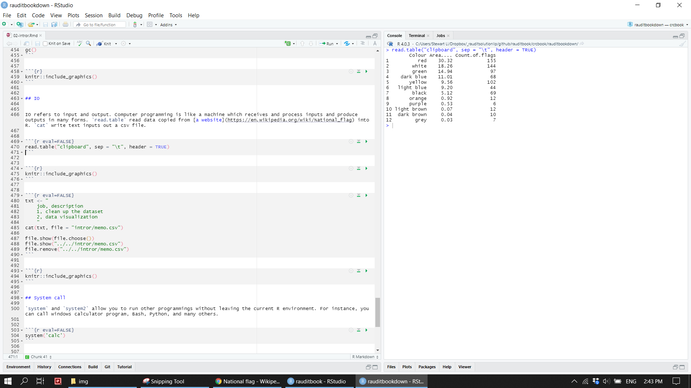
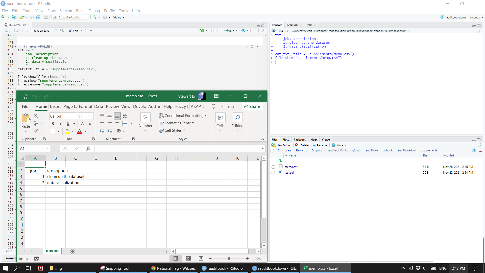
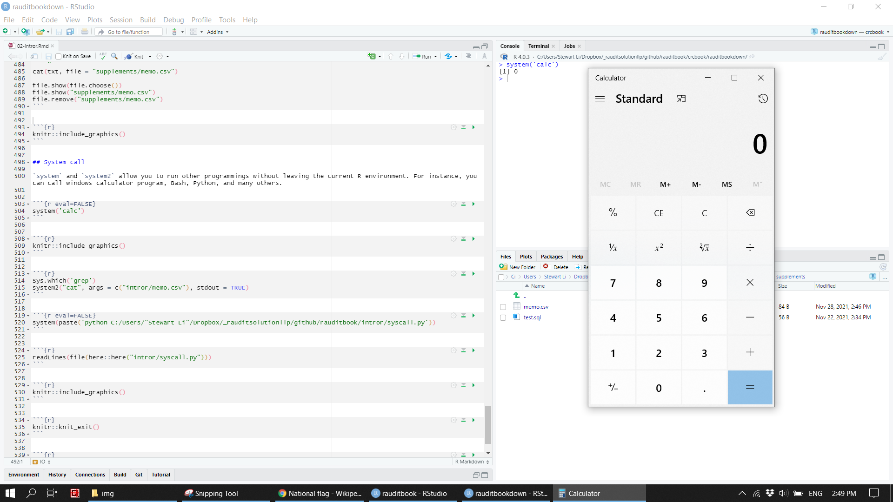
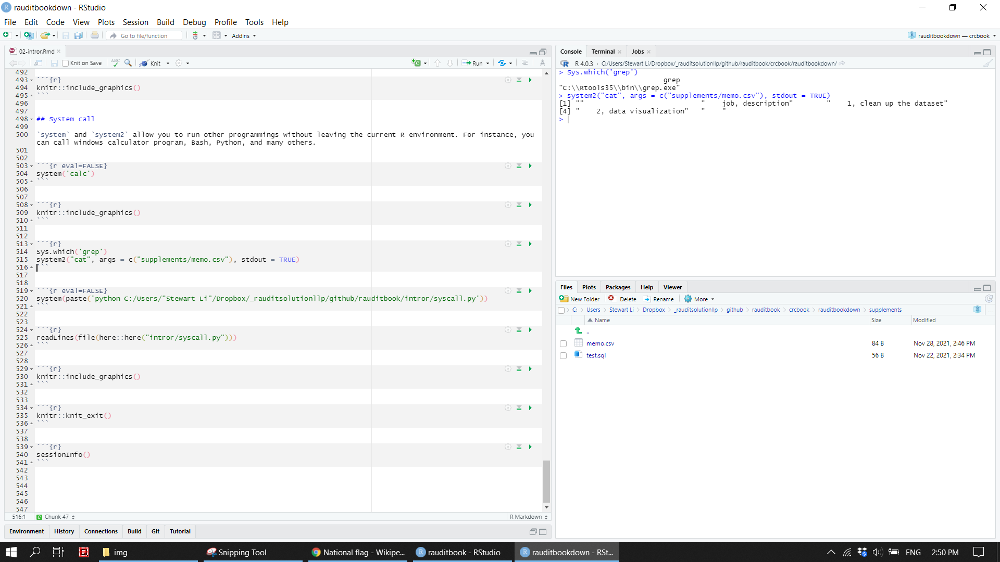
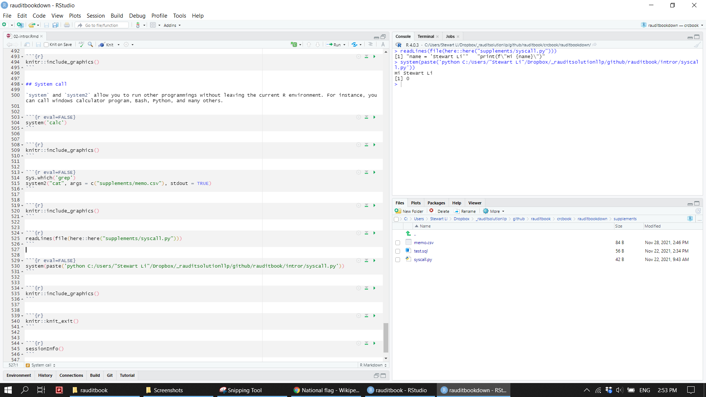

# R basics {#intror}

Most of computer programmings have a similar language structure which includes variable, data types, data structures, logical flow, functions, object orientation programming (OOP), modules, IO operations, and system call. In this structural way, the chapter covers R basics that will provide you some comfort to proceed. However, it is not intended to include all aspects of R. Many more existing resources would be recommended and you are advised to consult these resources in case you don't understand a certain topic.


## Setup

To start using R, you need to install [R](https://cran.r-project.org/), [RStudio](https://rstudio.com/products/rstudio/download/), and [Git Bash](https://git-scm.com/downloads). Let's get familiar with RStudio IDE and a couple of handy shortcuts.    
1. RStudio IDE 3 columns layout: Tools > Global Options > Pane Layout > Add Column    
2. Move around among panes: Ctrl + 1, Ctrl + 2, Ctrl + 3, etc.    
3. Command palette: Ctrl + Shift + P     
4. Go to a file: Ctrl + .    
5. Assignment operator <-: Alt + -      
6. Magrittr pipe %>%: Ctrl + Shift + M     
7. Insert code chunk in Rmarkdown document: Ctrl + Alt + I    


```{r}

```


Besides Base R, the book also uses other packages. Running the following codes will install and load those packages. Assuming all the required external packages have been properly installed, we are good to go. 


```{r eval=FALSE}
pkgs <- c("tidyverse", "data.table", "lubridate", "httr", "rvest", "usethis", "cli", "crayon",
          "R6",  "validate", "cowsay", "pdftools", "janitor", "skimr", "visdat", "naniar", 
          "DBI", "RSQLite", "dm", "dbplyr", 
          "knitr", "rmarkdown", "tinytex", "kableExtra", "DT", "formattable", 
          "unpivotr", "tidyxl", "readxl", "openxlsx",  
          "igraph", "ggraph", "tidygraph", "ggforce", "patchwork", "treemap",  "table1", 
          "shiny", "shinyWidgets", "bslib", "thematic", 
          "tidytext", "wordcloud2", "collapsibleTree", "data.tree", 
          "benford.analysis", "corrplot", "widyr", "vcd", "psych")
pkg <- pkgs[which(!pkgs %in% installed.packages())]

lapply(pkg, install.packages)
lapply(pkgs, library)
```


```{r include=FALSE, eval=FALSE}
knitr::write_bib(pkgs, 'packages.bib')
```


```{r}
cowsay::say(what = "Let's start it!", by = "pig", what_color = "red", by_color = "green")
```


## Help

Names of all exported functions available in a installed package can be displayed. If any of names is strange to you, run `?` or `help` to read documentation. 


```{r}
tibble(f = ls(getNamespace("base"))) %>% 
  dplyr::filter(str_detect(f, "^f")) 
```


```{r eval=FALSE}
?`[`
help(package = 'base')
```


## Variable

Common data types in R are character, double, integer, logical, complex, and raw. To store those data in a session, variables in the environment are created via `<-`, `=`, or `assign`. Variables subsequently can be read, updated, and deleted (CRUD). A specified operations run on variables are `eval` to spit out a final result.


```{r}
a <- "helloworld"                                                       
b <- 3.2
c <- 3L
d <- TRUE
e <- 1+4i
f1 <- charToRaw(a)
f2 <- intToBits(d)
```


```{r}
assign("g", 100, envir = globalenv())
get("g", globalenv())
ls()
```


```{r}
g <- 102
eval(g + 2)
```


An associated data type, bytecode, and size of variables can be checked by varying methods. One date type is converted to another via data cast.


```{r}
typeof(a)
class(b)
mode(c)
storage.mode(c)
str(d)

compiler::compile(e)
tracemem(e)                                                              
object.size(e)

is.raw(f1)
is.raw(f2)
```


```{r}
is.numeric(b)
as.character(b) %>% class()                                           
```


Strings is a special topic in any computer programming language and have many attributes and methods. For instance, you can manipulate and format strings through regular expression. 


```{r}
nchar(a)

chartr("o", "-", a)
substr(a, 2, 4)
sub("(w.*)", " ", a, ignore.case = TRUE)
gsub("(w.*)"," ", a)
substring(a, regexpr("(w.*)", a) + 1)

formatC(c, width = 4, flag = "0")
format(Sys.time(), format = "%U %w %H:%M:%S")
```


## Data structure

Types of data structure in R are `vector`, `data.frame`, `matrix`, `array`, and `list`. `vector`, `data.frame`, and `list` are the most frequently used. `vector` is a building block of others. Simply call `vector` to initialize an empty vector.


```{r eval=FALSE}
character(3) %>% class()
numeric(3) %>% length()
integer(3)
logical(3)
vector("character", length = 3) 
```


Create a numeric vector and assign to a variable v. Run `is` and `%in%` to check if v is a vector and 3 is one of component of v. `max` and `summary` give you a statistic description of v. `intersect` and others are used to compare two vectors.


```{r}
v <- c(rep(1:3, 3))

is(v, 'vector')
is.vector(v)
is.atomic(v)

is.element(3, v)
3 %in% v
```


```{r}
max(v)
summary(v)
```


```{r}
intersect(v, c(1:15))
setdiff(v, c(3:15))
union(v, c(20:30))
setequal(v, c(1:9))
```


A vector can be a named vector. Thus, either index position or element name is used to slice a piece out of data and complete CRUD operations.


```{r}
names(v) <- letters[1:9]                                              
v['a']                                                                

v[4]                                                                  
v[8:9]
v[-1]
```


```{r}
v['j'] <- 10                                                          
v['i'] <- 12
v
v[!names(v) %in% c('i')]
```


`data.frame` is a tabular format and contains columns, rows, and cell values. As such, it is very similar in nature to a typical spreadsheet. It's attributes include dimension (`dim`) , column names (`colnames`), and others. It also has multiple methods to compute statistics and manipulate (`subset`, `within`, and `aggregate`) data. 


```{r}
df <- data.frame(id = letters[1:10], x = 1:10, y = 11:20)
attributes(df)
attr(df, which = "class")
dim(df)
colnames(df)
rownames(df)
head(df, 2);tail(df, 2)
```


```{r}
colMeans(df[2:3])
rowSums(df[2:3])
cumsum(df$x)
pmin(df$y, 15)
```


```{r}
df['y']

df[df$y > 18, ]
subset(df, y > 18, select = c(1:3))

with(df, quantile(x, c(0.5, 0.75)))

within(df, {z = x + y})
aggregate(df[2:3], list(df$id > "f"), paste0)
```


Matrix and Array can be create by their constructors respectively. 


```{r}
m <- matrix(1:6, nrow = 2, ncol = 3, byrow = TRUE, dimnames = list(c("X","Y"), c("A","B", "C")))
df_m <- as.data.frame(m)
dimnames(df_m)
df_m
t(df_m)
```


```{r}
array(1:24, dim = c(2, 4, 3))                                              
```


List is able to contain any type of data and data structures. Run `vector` to create an empty list. Slice and CRUD operations on a list are similar as those mentioned above. 


```{r eval=FALSE}
vector("list", length = 3)
```


```{r}
l <- list(df_m, df)
l[[2]]

l[["df_m"]] <- c(13:19)
append(l, c(20))
l[4] <- NULL
l
```


## Control flow

`if` and `switch` (see \@ref(function)) allow you to specify the predefined logical conditions. The expected outcome should be attained after run your script. `for` and `while` loop repeat a certain action until "the end".


```{r}
if (.Platform$OS.type == 'windows'){
  sprintf("You are running on %s", str_to_title(Sys.info()['sysname']))    
}
```


```{r eval=FALSE}
while (TRUE) {
  x <- readline(prompt = "")
  if (x == 'q'){
    break
  }else{
    print(sprintf("You input is %s", x))
  }
}
```


```{r}

```


```{r}
for (i in seq(length(v))){
  if (names(v[i]) == 'c'){
    next
  }
  print(v[i])
}
```


In the world of R, a couple of alternatives to `for` loop are often used due to simplicity and performance. In particular, `apply` family from base R and `map` family from `purrr`.


```{r}
for (i in v){
  cat(v[i] * v[i], sep = "\n")
}

sapply(v, function(x) x*x)
map_dbl(v, ~.x*.x)
```


## Function 

Functions usually take one or more arguments as inputs and return an one or more desired outputs. For instance, a high order function takes an anonymous function as an argument. A function is viewed as a series of operations represented by an abstract syntax tree (`ast`). Refer to [Advanced R](https://adv-r.hadley.nz/) for details.


```{r}
Map(function(x) x*x, v)
Filter(function(x) x > 3, v)
Reduce(paste, v, accumulate = TRUE)
```


```{r}
args(Map)
formals(Map)
```


```{r}
lobstr::ast(Map(function(x) x*x, v))
```


Computer programming languages are very powerful because they allow users to write their own functions to meet their special needs. The following two examples illustrate how to write a function with `switch` and `{{}}` from `rlang` and use `stopifnot` for error handling.  


```{r}
st_do <- function(df, f, variable, ...){
  switch (f,
    select = df %>% select({{variable}}), 
    filter = df %>% dplyr::filter(mpg > 20), 
    mutate = df %>% mutate(...)                              
  )
}

st_do(mtcars, 'select', variable = c(contains('p'), starts_with('a')))
```


```{r}
st_do(mtcars, 'filter')
```


```{r}
st_do(mtcars, 'mutate', mpg2 = mpg/10)
```


```{r eval=FALSE}
st_look <- function(df, var, cond = NULL){
  stopifnot("Your variable is not inside the dataset" = as.integer(any(colnames(df) == substitute(var))) == 1) 
 
  dim_txt <- dim(df)
  cli::cli_alert_success(cli::pluralize("This dataset has {dim_txt[1]} row{?s} and {dim_txt[2]} column{?s}"))

  if(!is.null(cond)){
    filt_txt <- df %>%
      dplyr::filter(eval(parse(text = cond))) %>%
      summarise(across(c({{var}}), tibble::lst(mean, median))) %>% 
      mutate(across(everything(), round, 2)) %>% 
      mutate(across(everything(), crayon::bold))
  cli::cli_alert_success("The mean and median is {filt_txt[1]} and {filt_txt[2]} based on your condition")
  }else{
    stat_txt <- df %>%
      summarise(across(c({{var}}), tibble::lst(mean, median))) %>% 
      mutate(across(everything(), round, 2)) %>% 
      mutate(across(everything(), crayon::bold))
    cli::cli_alert_success("The mean and median is {stat_txt[1]} and {stat_txt[2]}")
  }
  usethis::ui_done(crayon::cyan("You are done here"))
}

st_look(mtcars, mpg)
st_look(mtcars, mpg, "am == 1")
```


```{r}

```


## OOP

Object-oriented programming (OOP) in R has S3, S4, RC, R6. R6 is demonstrated here as it feels like OOP of other computer programming languages.  


```{r eval=FALSE}
library(R6)
library(magrittr)

Audit <- R6::R6Class(
  classname = "Audit",
  public = list(
    df = NA,
    initialize = function(client, aic, df) {
      private$client <- client
      private$aic <- aic
      self$df <- df
      self$job()
      reg.finalizer(self,
                    function(e) print(getwd()),
                    onexit = FALSE)
    },
    set_client = function(client) {private$client <- client},
    set_aic = function(aic) {private$aic <- aic},
    job = function() {
      cat("\U0001F357", 
        paste0(private$aic, " is charge of the audit of ", private$client, 
               "'s dataset [", dim(self$df)[1], " ", dim(self$df)[2], "]", ".\n"))
    },
    describe = function(){
      self$df %>% 
        head() %T>%
        glimpse()
    }
  ), 
  private = list(
    client = NA,
    aic = NA
  )
)
```


```{r eval=FALSE}
xyz <- Audit$new("XYZ LLP", "Stewart Li", mtcars)
xyz$df <- iris
xyz$describe()

xyz$set_aic("Liu Meng")
xyz$job()

gc()
```


```{r}

```


## IO


IO refers to input and output. Computer programming is like a machine which receives and process inputs and produce outputs in many forms. `read.table` read data copied from [a website](https://en.wikipedia.org/wiki/National_flag) into R. `cat` write text inputs out a csv file.


```{r eval=FALSE}
read.table("clipboard", sep = "\t", header = TRUE)                 
```


```{r}

```


```{r eval=FALSE}
txt <- "
    job, description
    1, clean up the dataset
    2, data visualization
    " 
cat(txt, file = "supplements/memo.csv")

file.show(file.choose())
file.show("supplements/memo.csv")
file.remove("supplements/memo.csv")
```


```{r}

```


## System 

`system` and `system2` allow you to run other programmings without leaving the current R environment. For instance, you can call windows calculator program, Bash, Python, and many others.  


```{r eval=FALSE}
system('calc')
```


```{r}

```


```{r eval=FALSE}
Sys.which('grep')
system2("cat", args = c("supplements/memo.csv"), stdout = TRUE)
```


```{r}

```


```{r}
readLines(file(here::here("supplements/syscall.py")))
```


```{r eval=FALSE}
system(paste('python C:/Users/"Stewart Li"/Dropbox/_rauditsolutionllp/github/rauditbook/intror/syscall.py'))
```


```{r}

```


