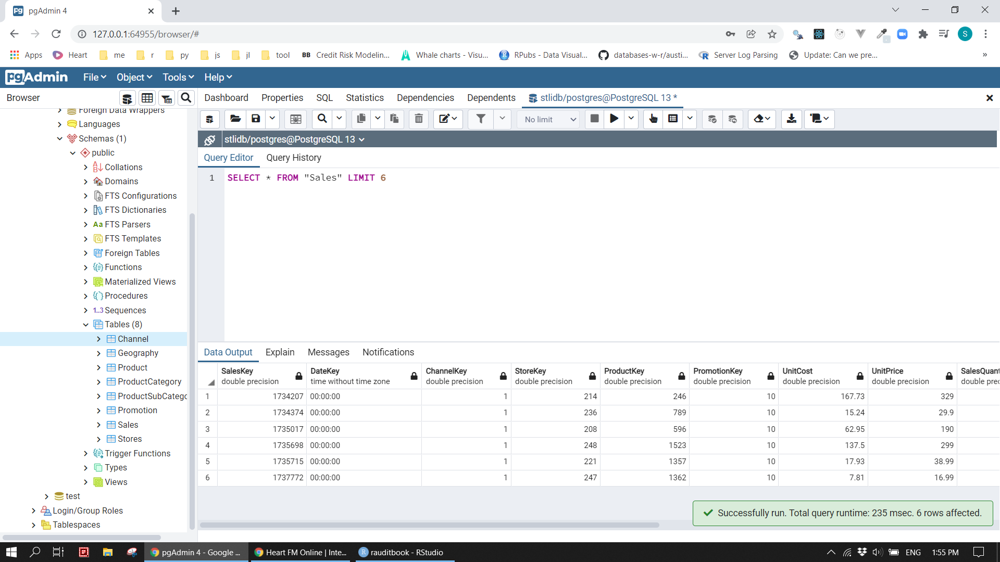
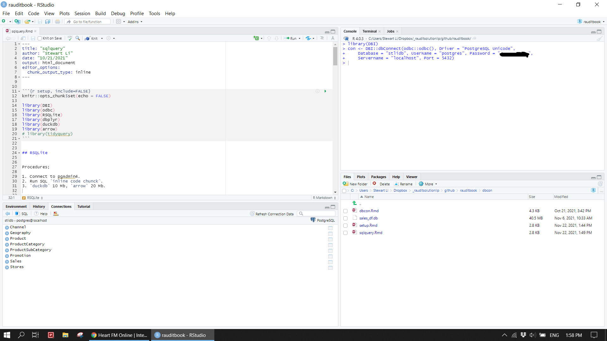
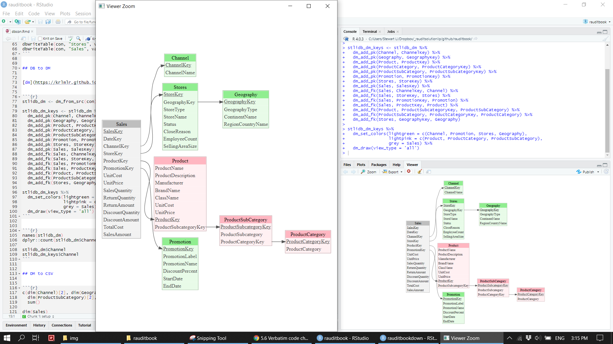
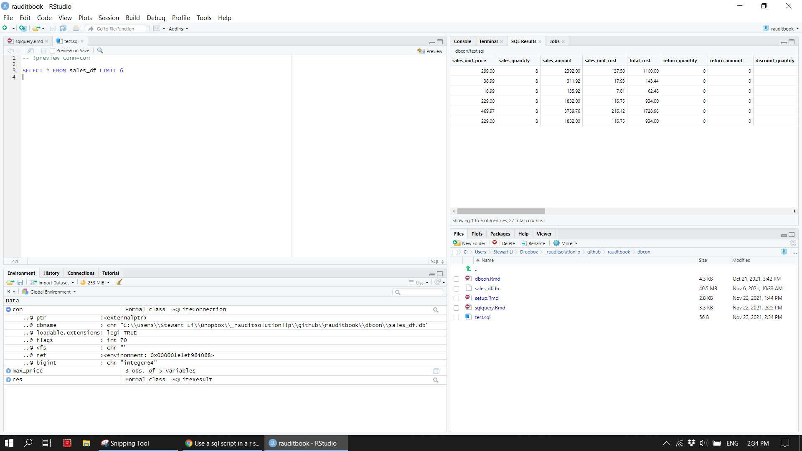

# Import 

As data could be stored in a csv file, database, cloud, and others, R facilitates numerous ways of importing data. For data easily fitted in the memory, you usually read it directly into a dataframe through `data.table`. For slightly bigger data, `RSQLite`, `duckdb` and `arrow` can be very useful in term of performance. Pretend the data live in PostgreSQL database in this case.   


## Dataset


### Data to database

This chapter uses [sales data in Excel](https://www.microsoft.com/en-sg/download/confirmation.aspx?id=46801) with multiple worksheets. To put them into a database named stlidb, we need to read Excel worksheets into R and then copy those objects to the database separately. The database now contains eight tables as shown Figure 1.


```{r eval=FALSE}
sheet_name <- readxl::excel_sheets(here::here("data", "ContosoData.xlsx"))[2:8]
df_list <- map(set_names(sheet_name), read_excel, path = here::here("data", "ContosoData.xlsx"))
list2env(df_list, envir = .GlobalEnv)
```


```{r eval=FALSE}
Sales <- read_csv(here::here('data/SampleContosoSalesTable.csv'))
```


```{r eval=FALSE}
con <- DBI::dbConnect(odbc::odbc(),
                     Driver = "PostgreSQL Unicode",                           
                     Database = "stlidb",
                     UserName = "postgres",
                     Password = "**********",
                     Servername = "localhost",
                     Port = 5432)

DBI::dbListTables(con)
DBI::dbDisconnect(con)
```


```{r eval=FALSE}
DBI::dbWriteTable(con, "Channel", value = Channel)
DBI::dbWriteTable(con, "Geography", value = Geography)
DBI::dbWriteTable(con, "Product", value = Product)
DBI::dbWriteTable(con, "ProductCategory", value = ProductCategory)
DBI::dbWriteTable(con, "ProductSubCategory", value = ProductSubCategory)
DBI::dbWriteTable(con, "Promotion", value = Promotion)
DBI::dbWriteTable(con, "Stores", value = Stores)
DBI::dbWriteTable(con, "Sales", value = Sales)
```


```{r}

```


```{r}

```


### Data model

All eight tables are interlinked each other. After added primary and foreign keys to them, their relationship is clearly displayed in Figure 2.


```{r eval=FALSE}
stlidb_dm <- dm_from_src(con)

stlidb_dm_keys <- stlidb_dm %>%
  dm_add_pk(Channel, ChannelKey) %>%
  dm_add_pk(Geography, GeographyKey) %>%
  dm_add_pk(Product, ProductKey) %>%
  dm_add_pk(ProductCategory, ProductCategoryKey) %>%
  dm_add_pk(ProductSubCategory, ProductSubcategoryKey) %>%
  dm_add_pk(Promotion, PromotionKey) %>%
  dm_add_pk(Stores, StoreKey) %>%
  dm_add_pk(Sales, SalesKey) %>%
  dm_add_fk(Sales, ChannelKey, Channel) %>%
  dm_add_fk(Sales, StoreKey, Stores) %>%
  dm_add_fk(Sales, PromotionKey, Promotion) %>%
  dm_add_fk(Sales, ProductKey, Product) %>%
  dm_add_fk(Product, ProductSubcategoryKey, ProductSubCategory) %>%
  dm_add_fk(ProductSubCategory, ProductCategoryKey, ProductCategory) %>% 
  dm_add_fk(Stores, GeographyKey, Geography) 

stlidb_dm_keys %>%
  dm_set_colors(lightgreen = c(Channel, Promotion, Stores, Geography), 
                lightpink = c(Product, ProductCategory, ProductSubCategory), 
                grey = Sales) %>%
  dm_draw(view_type = 'all')
```


```{r}

```


### Join tables

Sales table needs to be joined to other tables by primary and foreign keys to eventually obtain the required view of the data. Then, write the combined dataset out as a csv file. If you take a closer look at data, many of its columns are not meaningful or redundant. After removed those unused columns, the sales_df.csv is a final clean dataset on which we will use perform analysis. 


```{r eval=FALSE}
sales <- stlidb_dm_keys %>% dm_squash_to_tbl(Sales) %>% collect()
data.table::fwrite(sales, here::here('data/sales.csv'))
```


```{r}
paste0('The dataset is ', round(file.size(here::here('data/sales.csv'))/1000000, 2), " MB")
```


```{r}
sales <- read_csv(here::here('data/sales.csv'))
map_dbl(sales, ~length(unique(.x)))
```


```{r}
remove_col <- c('SalesKey', 'DateKey', 'ChannelKey', 'StoreKey', 'ProductKey', 'PromotionKey', 
                'ProductCategoryKey', "ProductSubcategoryKey", 'GeographyKey', 
                'ProductDescription', "PromotionLabel", 'CloseReason', 'GeographyType', 
                'Product.UnitCost', 'Product.UnitPrice')

select_col <- c('Sales.UnitPrice', 'SalesQuantity', 'SalesAmount', 'Sales.UnitCost', 'TotalCost',  
                'ReturnQuantity', 'ReturnAmount', 
                'DiscountQuantity', 'DiscountAmount', "DiscountPercent", 
                "PromotionName", 'StartDate', 'EndDate',
                'ChannelName', 'StoreType', 'StoreName', 'Status', 'EmployeeCount', 'SellingAreaSize',  
                'ContinentName', 'RegionCountryName', 
                'ProductName', 'ProductSubcategory', 'ProductCategory', 'Manufacturer', 'BrandName', 'ClassName')

removed <- (names(sales) %>% setdiff(select_col))
all(removed %in% remove_col)
```


```{r eval=FALSE}
sales_df <- sales %>% select(all_of(select_col))
data.table::fwrite(sales_df, here::here('data/sales_df.csv'))
```


```{r}
paste0('The dataset is ', round(file.size(here::here('data/sales_df.csv'))/1000000, 2), " MB")
```


## SQLite

R can connect to various databases. It becomes more common to load data into a database and write queries in SQL and R interchangeably in a R session. This section shows a brief example. 


### Connection


```{r}
con <- DBI::dbConnect(RSQLite::SQLite(), dbname = here::here("supplements/sales_df.db"))
```


```{r eval=FALSE}
DBI::dbWriteTable(con, "sales_df", sales_df, overwrite = TRUE)
```


```{r eval=FALSE}
dplyr::copy_to(con, mtcars, "mtcars")
```


```{r}
DBI::dbListTables(con)
```


```{r}
DBI::dbListFields(con, 'sales_df')
```


### R code chunk


```{r}
DBI::dbGetQuery(con, 'SELECT sales_unit_price, product_category, store_type FROM sales_df LIMIT 3')
```


```{r}
tbl(con, "sales_df") %>%
  select(sales_unit_price, product_category, store_type) %>% 
  dplyr::filter(sales_unit_price > 2800)
```


```{r}
tbl(con, "sales_df") %>%
  select(sales_unit_price, product_category, store_type) %>% 
  dplyr::filter(sales_unit_price > 2800) %>% 
  show_query() %>% 
  capture.output() %>%                               
  .[2:length(.)] %>% 
  str_replace_all("`", "") %>% 
  str_c(collapse = " ")
```


### SQL code chunk


```{sql, connection = con}
-- This is a SQL comment
SELECT sales_unit_price, product_category, store_type 
FROM sales_df
WHERE sales_unit_price > 2800
LIMIT 3
```


```{sql, connection = con, output.var = "max_price"} 
SELECT sales_unit_price, product_category, store_type, AVG(sales_unit_price) OVER (PARTITION BY product_category) AS avg_price, MAX(sales_unit_price) OVER (PARTITION BY product_category) AS max_price
FROM sales_df
WHERE store_type IN ('Store', 'Online')
ORDER BY product_category, store_type
LIMIT 3;
```


```{r}
max_price
```


You can run an external SQL file inside of code chunk. The result will show up when you knit the document. However, you can preview  SQL query result. 


```{r}
cat(readr::read_file("supplements/test.sql"))
```


````
<!-- ```{sql connection=con, output.var="sales_df_preview", code=readLines("supplements/test.sql")} -->

<!-- ``` -->


<!-- ```{r eval=FALSE} -->
<!-- sales_df_preview -->
<!-- ``` -->
````


```{r}
DBI::dbDisconnect(con)
```


```{r}

```


