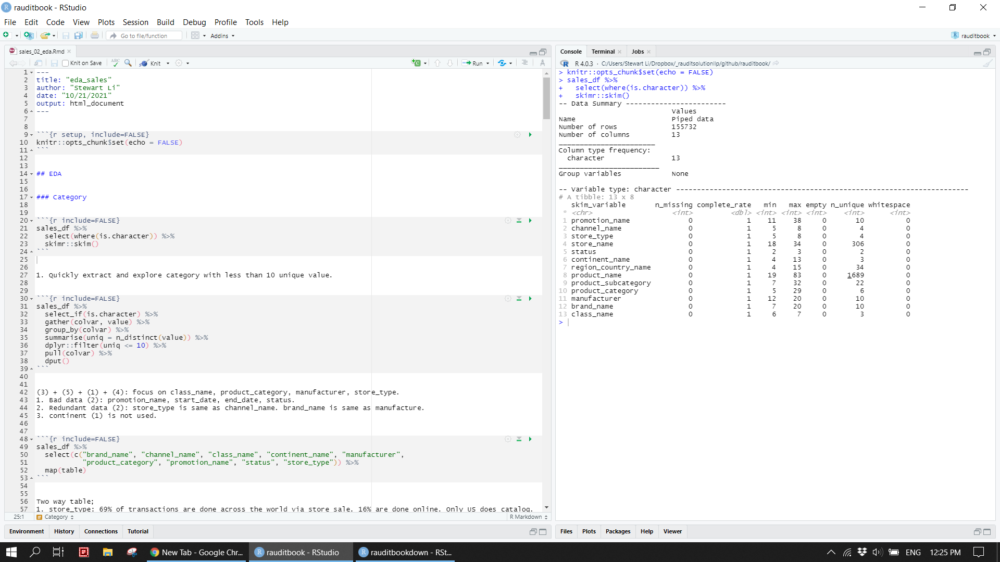
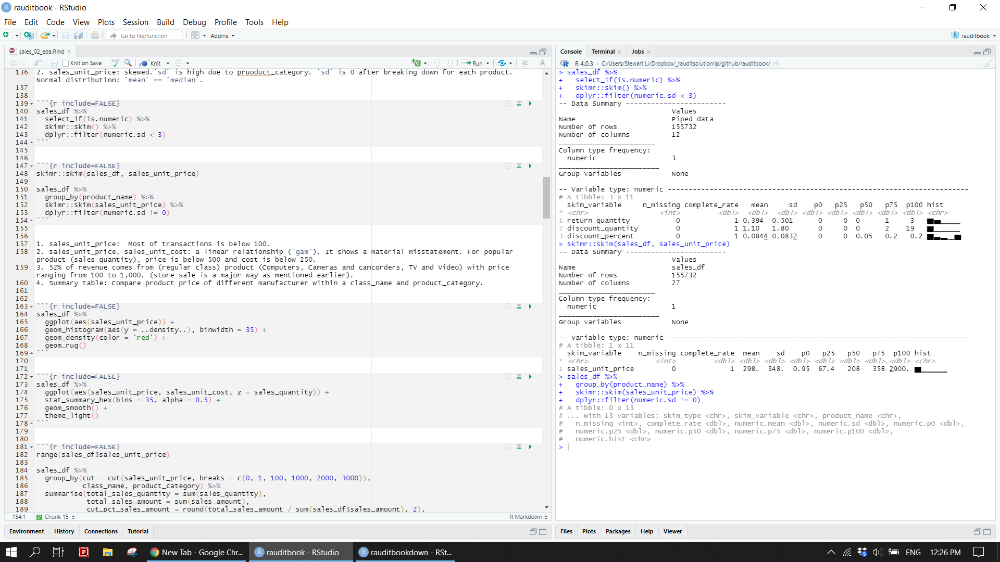
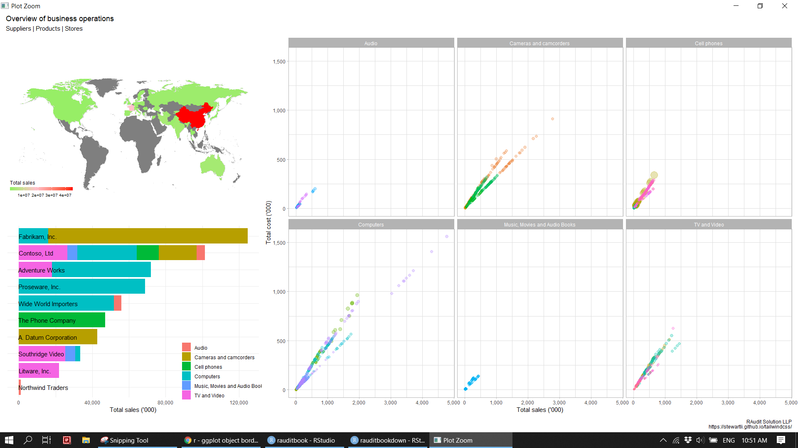
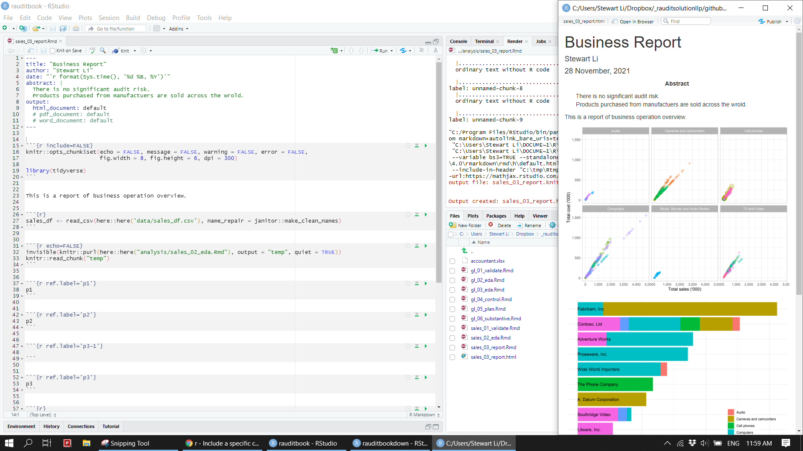
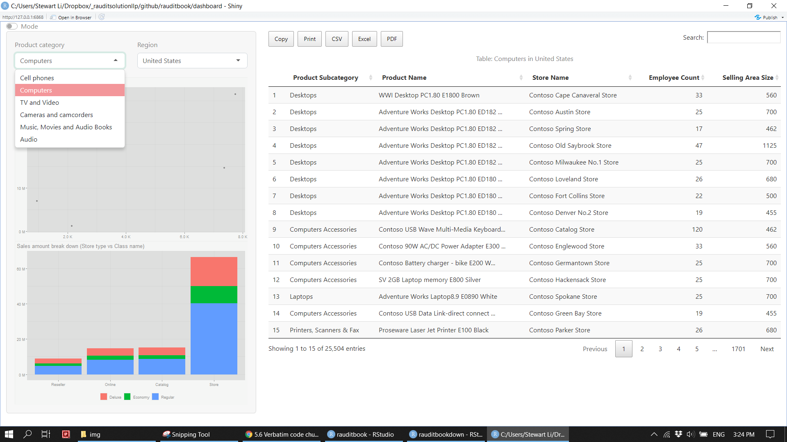
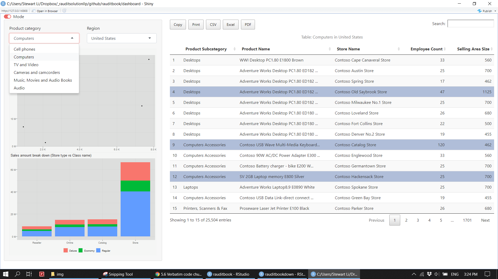

# FP&A

In general, FP&A produce a business insight report after analyzed varying source of data. Their workflow includes 1) data extraction out of a database; 2) data validation; 3) thoroughly analysis; 4) graphic presentation; 5) reports in various forms; 6) dashboard. Although this chapter is written from FP&A point of view, techniques can be used by other accounting professionals. 


## Validation

Data is validated based on your expectation before detailed analysis. For instance, sales unit price is expected to be positive number. sales unit price multiply with sales quantity is expected to equal to sales amount.   


```{r}
sales_df <- read_csv(here::here('data/sales_df.csv'), name_repair = janitor::make_clean_names) 
```


```{r}
library(validate)

out <- sales_df %>% 
  validate::check_that(
    sales_unit_price > 0,
    sales_unit_cost > 0,
    sales_quantity > 0,
    return_quantity >= 0,
    discount_quantity >= 0,
    discount_percent < 1,
    sales_unit_price >= sales_unit_cost, 
    sales_quantity >= return_quantity,  
    sales_quantity >= discount_quantity, 
    abs((sales_unit_price * sales_quantity) - sales_amount) < 10, 
    abs((sales_unit_cost * sales_quantity) - total_cost) < 10, 
    sales_unit_price * return_quantity - return_amount < 10, 
    sales_unit_price * discount_percent * discount_quantity - discount_amount < 10, 
    sales_amount >= total_cost, 
    sales_amount >= return_amount, 
    sales_amount >= discount_amount, 
    end_date - start_date < 365) 
  
summary(out)
plot(out)

v_amt <- validate::violating(sales_df, out[10:11]) 
v_date <- validate::violating(sales_df, out[17]) 
```


Surprisingly, sales unit price multiply with sales quantity does not equal to sales amount. Those outlier are `filter` out to be examined in detail. If you were an external auditor and should pay a special attention to those as the sum of those immaterial misstatements becomes significantly material. Furthermore, it is unusual that promotion period (end date minus start date) is more than one year. It could be an error that stores whose status is off incur staff and rental cost. Since the illustration based on dummy data, those discreteness will be ignored subsequently.  


```{r}
sales_df[sample(nrow(sales_df), 2000), ] %>% 
  ggplot(aes(x = sales_amount, y = sales_unit_price * sales_quantity)) +
  geom_point(size = 1, alpha = 0.2) 
```


```{r}
d_amt <- sales_df %>% 
  mutate(out_sales = sales_unit_price * sales_quantity, 
         res_sales = ifelse(abs(out_sales - sales_amount) < 10, "pass", 'fail'), 
         out_cost = sales_unit_cost * sales_quantity, 
         res_cost = ifelse(abs(out_cost - total_cost) < 10, "pass", 'fail')) %>% 
  dplyr::filter(res_sales == "fail" | res_cost == "fail") 

anti_join(v_amt, d_amt)
```


```{r}
d_amt %>% 
  transmute(diff_sales = sales_unit_price * sales_quantity - sales_amount, 
            diff_cost = sales_unit_cost * sales_quantity - total_cost) %>% 
  summarise(diff_total_sales = sum(diff_sales), 
            diff_total_cost = sum(diff_cost))
```


```{r}
d_date <- sales_df %>% 
  mutate(period = end_date - start_date) %>% 
  dplyr::filter(period > 365)

anti_join(v_date, d_date)
```


```{r}
count(sales_df, status)

sales_df %>% 
  dplyr::filter(status == 'Off' & (employee_count > 0 | selling_area_size > 0))
```


## EDA

We will focus on columns of class name, product category, manufacturer, store type, and sales unit price. Columns of promotion name, start date, end date, status, channel name, brand name, and continent are left unused.   


### Categorical 


```{r eval=FALSE}
sales_df %>% 
  select(where(is.character)) %>% 
  skimr::skim()
```


```{r}

```


Quickly extract categorical variables with less than 10 unique values and then explore them. 
1. 69% of sales is done via store across the world. 16% is done by online. Only US uses catalog. China, Germany, and US use online.
2. 50% of sales of expensive computers (50%) is from a supplier (Proseware, Inc.).


```{r}
sales_df %>% 
  select_if(is.character) %>%
  gather(colvar, value) %>% 
  group_by(colvar) %>% 
  summarise(uniq = n_distinct(value)) %>% 
  dplyr::filter(uniq <= 10) %>% 
  pull(colvar) %>% 
  dput()
```


```{r}
sales_df %>% 
  select(c("brand_name", "channel_name", "class_name", "continent_name", "manufacturer", 
           "product_category", "promotion_name", "status", "store_type")) %>% 
  map(table)
```


```{r}
prop.table(table(sales_df$channel_name, sales_df$store_type))
```


```{r}
addmargins(table(sales_df$region_country_name, sales_df$store_type), FUN = list(Total = sum), quiet = TRUE)
```


```{r}
ftable(xtabs(~ product_category + class_name, data = sales_df))
```


```{r}
ftable(table(sales_df$manufacturer, sales_df$product_category, sales_df$class_name))
```


Plot categorical variables based on frequency count. Refer to [ggplot2: elegant graphics for data analysis](https://ggplot2-book.org/) to learn how to plot.


```{r}
sales_df%>% 
  ggplot(aes(x = class_name, fill = class_name)) +
  geom_bar(width = .2, show.legend = FALSE) +
  geom_text(aes(label = ..count..), stat = "count", vjust = 1.5) +
  scale_y_continuous(labels = scales::comma) +
  labs(x = NULL, y = NULL)
```


```{r}
sales_df %>% 
  count(product_category, class_name, manufacturer, store_type) %>% 
  pivot_longer(-n, 
               names_to = "var",  
               values_to = "val") %>% 
  mutate(val = tidytext::reorder_within(val, n, var, sum)) %>% 
  ggplot(aes(n, val)) +
  geom_col() +
  tidytext::scale_y_reordered() +
  facet_wrap(~var, scales = 'free_y') +
  labs(x = NULL, y = NULL)
```


Reshape the data from a long format to a wide format. `filter` data based on the specified conditions and `count` a variable. 


```{r}
sales_df %>% 
  count(class_name, product_category, manufacturer, store_type) %>% 
  spread(store_type, n, fill = 0)
```


```{r}
sales_df %>% 
  dplyr::filter(region_country_name == 'United States') %>% 
  count(store_name)
```


```{r}
sales_df %>% 
  group_by(store_name) %>% 
  dplyr::filter(n() > 8000) %>% 
  count(store_name)
```


### Numeric

This section focus on sales_unit_price. 
1. `sd` of return_quantity, discount_quantity, and discount_percent is small. Their fraud risk is low.
2. sales_unit_price is skewed. However, it shows a normal distribution at the level product category.


```{r eval=FALSE}
sales_df %>% 
  select_if(is.numeric) %>% 
  skimr::skim() %>% 
  dplyr::filter(numeric.sd < 3)
```


```{r eval=FALSE}
skimr::skim(sales_df, sales_unit_price)   

sales_df %>% 
  group_by(product_name) %>% 
  skimr::skim(sales_unit_price) %>% 
  dplyr::filter(numeric.sd != 0) 
```


```{r}

```


Plot numeric variables.
1. There is a a linear relationship between sales unit price and sales unit cost. 
2. Most of sales is below 100. Popular products have price below 500 and cost below 250. 


```{r}
sales_df %>% 
  ggplot(aes(sales_unit_price)) +
  geom_histogram(aes(y = ..density..), binwidth = 35) +
  geom_density(color = 'red') +
  geom_rug() 
```


```{r}
sales_df %>% 
  ggplot(aes(sales_unit_price, sales_unit_cost, z = sales_quantity)) +
  stat_summary_hex(bins = 35, alpha = 0.5) +
  geom_smooth() 
```


1. 52% of revenue comes from regular class products (Computers, Cameras and camcorders, TV and Video) with price ranging from 100 to 1,000.
2. `summarize` sales unit price of different manufacturer within a class name and product category.
3. `summarize` sales unit price by product name when class name is Deluxe.


```{r}
sales_df %>% 
  group_by(cut = cut(sales_unit_price, breaks = c(0, 1, 100, 1000, 2000, 3000)), 
           class_name, product_category) %>% 
  summarise(total_sales_quantity = sum(sales_quantity), 
            total_sales_amount = sum(sales_amount), 
            cut_pct_sales_amount = round(total_sales_amount / sum(sales_df$sales_amount), 2), 
            .groups = 'drop') %>% 
  arrange(-cut_pct_sales_amount) 
```


```{r}
sales_df %>% 
  dplyr::filter(near(sales_unit_price, max(sales_unit_price), tol = sd(sales_unit_price)))

sales_df %>% 
  dplyr::filter(between(sales_unit_price, 0, 1))
```


```{r}
sales_df %>% 
  transmute(new_number = 1000 *(sales_unit_price %/% 1000)) %>% 
  count(new_number)
```


```{r}
sales_df %>% 
  group_by(class_name, product_category, manufacturer, store_type) %>% 
  summarise(across(c(sales_unit_price), tibble::lst(first, last, min, max, mean, median)))
```


```{r}
sales_df %>% 
  group_by(product_name) %>% 
  summarise(across(c(sales_unit_price), tibble::lst(min, max, mean, median)), 
            total_price_sales_amount = sum(sales_amount[sales_unit_price > median(sales_unit_price)]), 
            total_class_sales_amount = sum(sales_amount[class_name == 'Deluxe'])) 
```


```{r}
sales_df %>% 
  dplyr::filter(class_name == "Deluxe", 
                product_category == "Cameras and camcorders", 
                manufacturer == "Fabrikam, Inc.", 
                store_type == 'Store') 
```


## Business ananlysis


### Product profit margin

1. There is no unusual profit margin for each product name in the cases of return or discount.
2. Profit margin percentage (average 50%) of each product name remains unchanged within each country.
3. Top 5 the most sold products only take 1% of revenue. There is no concentration risk. 
4. Top 3 sales amount of product name from each product category.
5. `summarize` the whole dataset based on class name, product category, manufacturer, store type.


```{r}
sales_df %>% 
  dplyr::filter(discount_quantity > 0, return_quantity > 0) %>% 
  mutate(pm_pct = (sales_unit_price - sales_unit_cost) / sales_unit_price) %>% 
  group_by(product_name) %>% 
  summarise(across(c(discount_quantity, discount_amount, return_quantity, return_amount, 
                     sales_quantity, sales_amount), sum), 
            discount_amount_pct = discount_amount / sales_amount, 
            return_amount_pct = return_amount / sales_amount, 
            avg_pm_pct = mean(pm_pct)) 
```


```{r}
sales_df %>% 
  mutate(pm_pct = (sales_unit_price - sales_unit_cost) / sales_unit_price) %>% 
  group_by(product_name, region_country_name) %>% 
  summarise(across(c(pm_pct), tibble::lst(min, max, mean, median))) %>%
  dplyr::filter(pm_pct_min != pm_pct_max, pm_pct_mean != pm_pct_median) 
```


```{r}
sales_df %>% 
  mutate(pm_pct = (sales_unit_price - sales_unit_cost) / sales_unit_price) %>% 
  mutate(product = fct_lump(product_name, 5)) %>% 
  group_by(product) %>% 
  summarise(across(c(sales_quantity, sales_amount), sum), 
            avg_pm_pct = mean(pm_pct), 
            total_sales_pct = sales_amount / sum(sales_df$sales_amount))
```


```{r}
sales_df %>% 
  mutate(pm_pct = (sales_unit_price - sales_unit_cost) / sales_unit_price) %>% 
  group_by(product_category, product_name) %>% 
  summarise(across(c(sales_quantity, sales_amount), sum), 
            avg_pm_pct = mean(pm_pct)) %>% 
  slice_max(order_by = sales_amount, n = 3)
```


```{r}
sales_df %>% 
  mutate(pm_pct = (sales_unit_price - sales_unit_cost) / sales_unit_price) %>% 
  group_by(class_name, product_category, manufacturer, store_type) %>% 
  summarise(across(c(sales_unit_price, pm_pct), tibble::lst(min, max)), 
            across(c(sales_quantity, sales_amount), tibble::lst(sum)), 
            no_of_store = n_distinct(store_name)) 
```


```{r}
sales_df %>% 
  nest(data = -c(class_name, product_category, manufacturer, store_type)) %>% 
  mutate(new = map(data, ~.x[['sales_unit_price']][20])) %>% 
  unnest(new)
```


Assume that product name containing "15-Inch" will be taxed at 17%. Calculate total tax amount on the specified product name. Some of product name is longer than 80 characters. Pull out to see them fully. 


```{r}
sales_df %>% 
  mutate(tax = ifelse(str_detect(product_name, '15-Inch'), sales_unit_price * .17, 0)) %>% 
  summarise(total_tax = sum(tax))

sales_df %>% 
  dplyr::filter(grepl('15-Inch', product_name)) %>% 
  summarise(total_tax = sum(sales_unit_price * .17))
```


```{r}
sales_df %>% 
  dplyr::filter(nchar(product_name) > 80) %>% 
  distinct(product_name) %>% 
  pull()
```


### Product category

1. `summarize` the average of discount amount and quantity by product category.
2. `summarize` data based on product category, product subcategory, product name and `ggplot` sale amount and total cost.


```{r}
sales_df %>% 
  select(product_category, contains('discount')) %>% 
  group_by(product_category) %>% 
  summarise(across(c(contains('discount')), mean))
```


```{r}
product_df <- sales_df %>% 
  group_by(product_category, product_subcategory, product_name) %>% 
  summarise(across(c(sales_quantity, sales_amount, total_cost, return_amount, discount_amount), sum), 
            .groups = 'drop') 

(p1 <- product_df %>% 
  ggplot(aes(sales_amount, total_cost, color = product_subcategory, size = sales_quantity)) +
  geom_point(alpha = .3, show.legend = FALSE) +
  facet_wrap(~ product_category) +
  scale_x_continuous(labels = scales::label_number(scale = 1e-3, accuracy = NULL, big.mark = ",")) +
  scale_y_continuous(labels = scales::label_number(scale = 1e-3, accuracy = NULL, big.mark = ",")) +
  expand_limits(y = 0) +
  labs(x = "Total sales ('000)", 
       y = "Total cost ('000)") +
  theme_light())
```


### Manufactuer

1. Identify the outlier of sales unit price based on manufacturer.
2. `summarize` total sales amount and percentage of products purchased from manufacturers within each product category and `ggplot` barchart.


```{r}
sales_df %>% 
  mutate(manufacturer = fct_reorder(manufacturer, sales_unit_price)) %>% 
  ggplot(aes(sales_unit_price, manufacturer), alpha = .3) +
  geom_boxplot() 
```


```{r}
supplier_df <- sales_df %>% 
  group_by(manufacturer, product_category) %>% 
  summarise(total_sales_amount = sum(sales_amount), 
            pct = round(total_sales_amount / sum(sales_df$sales_amount), 2), 
            .groups = 'drop') %>% 
  arrange(-total_sales_amount)

text_df <- tibble(manufacturer = unique(supplier_df$manufacturer), 
                  total_sales_amount = 40000) 

(p2 <- supplier_df %>% 
  mutate(manufacturer = fct_reorder(manufacturer, total_sales_amount, sum)) %>% 
  ggplot(aes(total_sales_amount, manufacturer)) +
  geom_col(aes(fill = product_category)) +
  geom_text(data = text_df, aes(label = manufacturer), hjust = 0.01) +
  scale_x_continuous(labels = scales::label_number(scale = 1e-3, accuracy = NULL, big.mark = ",")) +
  scale_fill_discrete(name = '') +
  labs(x = "Total sales ('000)", y = NULL) +
  theme_minimal() +
  theme(legend.position = c(0.86, 0.18), 
        legend.background = element_rect(fill = 'transparent', color = NA), 
        axis.text.y = element_blank(), 
        plot.background = element_rect(fill = NA, colour = NA), 
        panel.background = element_blank()))
```


### Store

1. Calculate total sales amount for each store name. `ggplot` employee count and selling area size to identify outlier. For instance, one small store has more than 300 staffs.
2. Map store location across the world.


```{r}
staff_df <- sales_df %>% 
  group_by(store_name) %>% 
  mutate(total_sales_amount = sum(sales_amount)) %>% 
  select(store_name, employee_count, selling_area_size, total_sales_amount) %>% 
  distinct(store_name, .keep_all = TRUE) %>% 
  dplyr::filter(!is.na(employee_count))

staff_df %>% 
  ggplot(aes(employee_count, selling_area_size)) +
  geom_point(aes(size = total_sales_amount), alpha = .3, show.legend = FALSE) +
  ggforce::geom_mark_ellipse(aes(filter = selling_area_size > 80000, 
                                 description = "Typo error?")) +
  ggforce::geom_mark_ellipse(aes(filter = employee_count > 300,
                                 description = "Enquery?"))
```


```{r}
store_map <- map_data("world") %>% 
  mutate(region = case_when(region == 'USA' ~ "United States", 
                            region == 'UK' ~ "United Kingdom", 
                            region == 'Netherlands' ~ "the Netherlands", 
                            TRUE ~ region)) %>% 
  left_join(sales_df %>% 
              group_by(store_name, store_type, region_country_name) %>% 
              summarise(total_sales_amount = sum(sales_amount), 
                        .groups = 'drop'), 
            by = c("region" = "region_country_name")) 

(p3 <- store_map %>%
  ggplot(aes(long, lat, group = group, fill = total_sales_amount)) +
  borders("world", colour = "gray85", fill = "gray80") +
  geom_polygon() +
  scale_y_continuous(limits = c(-60, 90)) +
  scale_fill_gradient2(high = "green", low = "red", mid = "pink", midpoint =  18627586) +
  ggthemes::theme_map() +
  coord_fixed(1.3) +
  guides(fill = guide_colorbar(direction = 'horizontal', 
                               title.position = "top",
                               barheight = unit(0.2, "cm"), 
                               barwidth = unit(4, "cm"))) +
  labs(fill = "Total sales")) 
```


## Info graphic


```{r eval=FALSE}
library(patchwork)

layout <- "
AACCCC
AACCCC
BBCCCC
BBCCCC
"

(p <- p3 + p2 + p1 + 
  plot_layout(design = layout) +
  plot_annotation(title = "Overview of business operations", 
                  subtitle = 'Suppliers | Products | Stores', 
                  caption = 'RAudit Solution LLP\nhttps://stewartli.github.io/tailwindcss/') &
  theme(plot.tag.position = c(0, 1),
        plot.tag = element_text(size = 8, hjust = 0, vjust = 0)))
```


```{r}

```


## Report

A nice summary table and plot can be easily included in a `Rmarkdown` document. A final report is produced in the form of HTML, PDF, and Words.


```{r}

```


## Dashboard

You might be asked to make a BI dashboard which allows your users to explore data interactively. To learn more, refer to [Mastering Shiny](https://mastering-shiny.org/)


```{r eval=FALSE}
library(shiny)
library(DT)
library(shinyWidgets)
library(bslib)
library(thematic)

theme_toggle <- function() {
  div(class = "custom-control custom-switch",
      tags$input(
        id = "custom_mode",
        type = "checkbox",
        class = "custom-control-input",
        onclick = HTML("Shiny.setInputValue('dark_mode', document.getElementById('custom_mode').value);")
      ),
      tags$label(
        "Mode",
        `for` = "custom_mode",                                   
        class = "custom-control-label")
  )
}
```


```{r eval=FALSE}
ui <- fluidPage(
  theme_toggle(), 
  theme = bslib::bs_theme(bootswatch = 'minty'),   
  sidebarLayout(
    sidebarPanel(
      width = 4, 
      fluidRow(
        column(6, selectInput("productcat", "Product category", unique(sales_df$product_category))), 
        column(6, selectizeInput("region", "Region", unique(sales_df$region_country_name))) 
      ), 
      plotOutput("topsupplier"), 
      plotOutput("storetype")
    ), 
    mainPanel(
      width = 8, 
      DT::DTOutput("tbl")
    )
  )
)
```


```{r eval=FALSE}
server <- function(input, output, session) {
  df <- reactive({
    sales_df %>% 
      dplyr::filter(product_category %in% input$productcat, region_country_name %in% input$region)
  })
  observeEvent(input$custom_mode, {
    session$setCurrentTheme(
      if (input$custom_mode) bslib::bs_theme(bootswatch = 'journal') else bslib::bs_theme(bootswatch = 'minty')
    )
  })
  output$topsupplier <- renderPlot({
    df() %>% 
      group_by(manufacturer) %>% 
      summarise(n = n(), 
                amt = sum(sales_amount)) %>% 
      slice_max(order_by = amt, n = 10) %>% 
      ggplot(aes(n, amt)) +
      geom_point() +
      scale_x_continuous(label = scales::unit_format(scale = 1e-3, unit = "K")) +
      scale_y_continuous(label = scales::unit_format(scale = 1e-6, unit = "M")) +
      labs(title = "Top 10 supplier (Frequency vs Amount)", 
           x = NULL, y = NULL) +
      theme(plot.title.position = "plot")
  })
  output$storetype <- renderPlot({
    df() %>% 
      group_by(store_type, class_name) %>% 
      summarise(amt = sum(sales_amount), .groups = "drop") %>% 
      mutate(store_type = fct_reorder(store_type, amt)) %>% 
      ggplot(aes(store_type, amt, fill = class_name)) +
      geom_col() +
      scale_y_continuous(label = scales::unit_format(scale = 1e-6, unit = "M")) +
      scale_fill_discrete(name = "") +
      labs(title = "Sales amount break down (Store type vs Class name)", 
           x = NULL, y = NULL) +
      theme(plot.title.position = "plot", 
            legend.position = "bottom", 
            legend.direction = "horizontal", 
            legend.background = element_rect(fill = "transparent"))
  })
  output$tbl <- DT::renderDT(server = FALSE, {
    df() %>% 
      select(product_subcategory, product_name, store_name, employee_count, selling_area_size) %>% 
      mutate(product_name = str_trunc(product_name, width = 40, ellipsis = "...")) %>% 
      rename_with(function(x) str_to_title(str_replace_all(x, "_", " ")), everything()) %>% 
      DT::datatable(
        caption = htmltools::tags$caption(style = 'caption-side: top; text-align: center;',
                                          paste0("Table: ", input$productcat, " in ", input$region)), 
        extensions = c("Scroller", "FixedColumns", "Buttons"), 
        options = list(
          dom = "Bfrtip",
          pageLength = 15, 
          buttons = c("copy", "print", "csv", "excel", "pdf")
        )
      )
  })
}


thematic::thematic_shiny()
shinyApp(ui, server)
```


```{r}

```


```{r}

```


