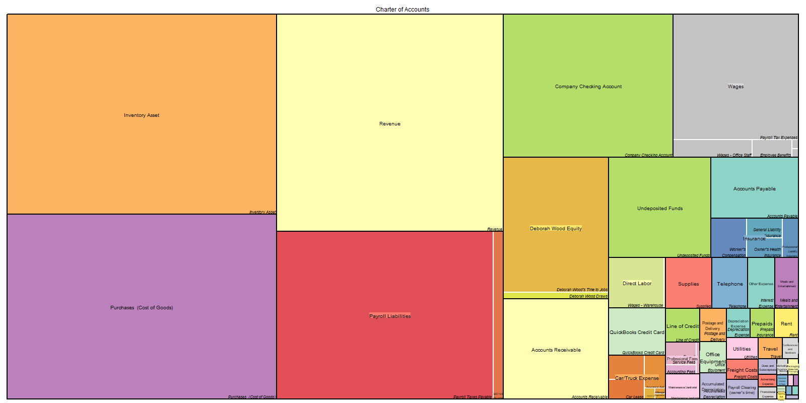
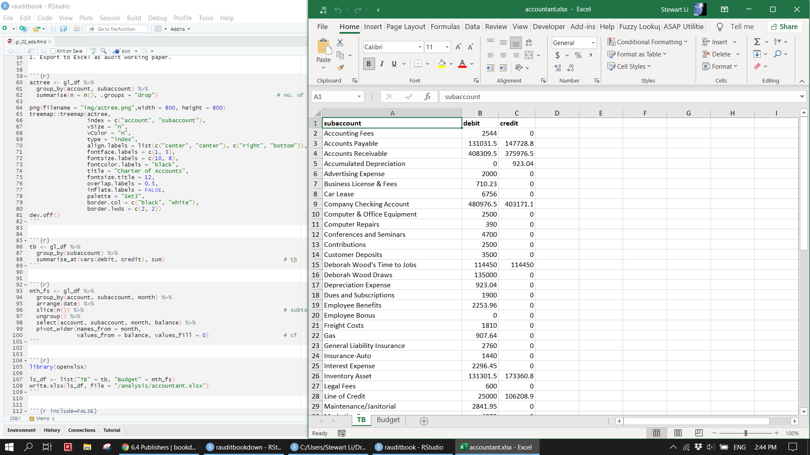
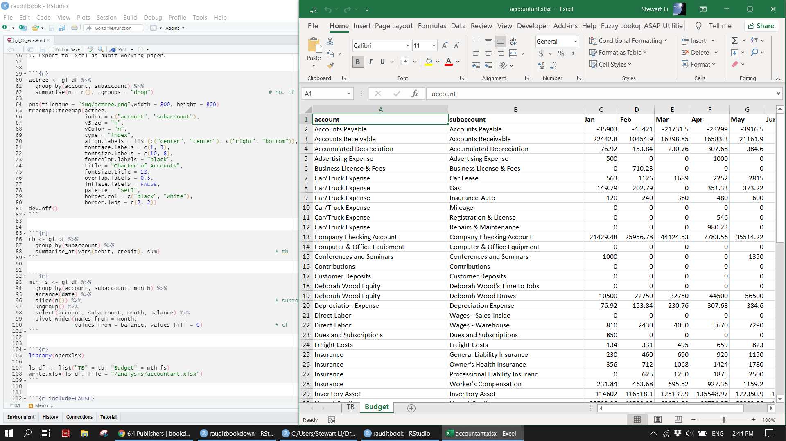
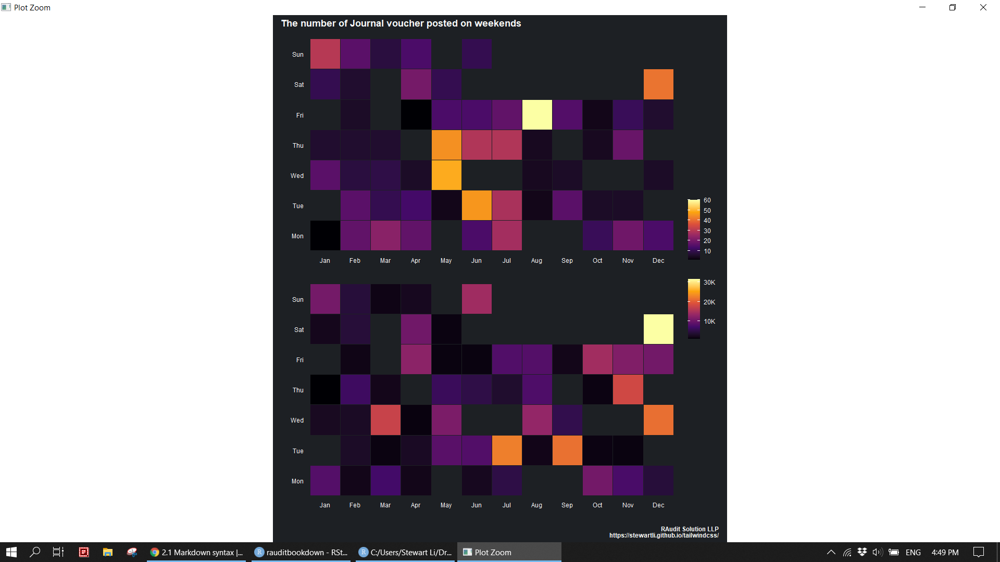
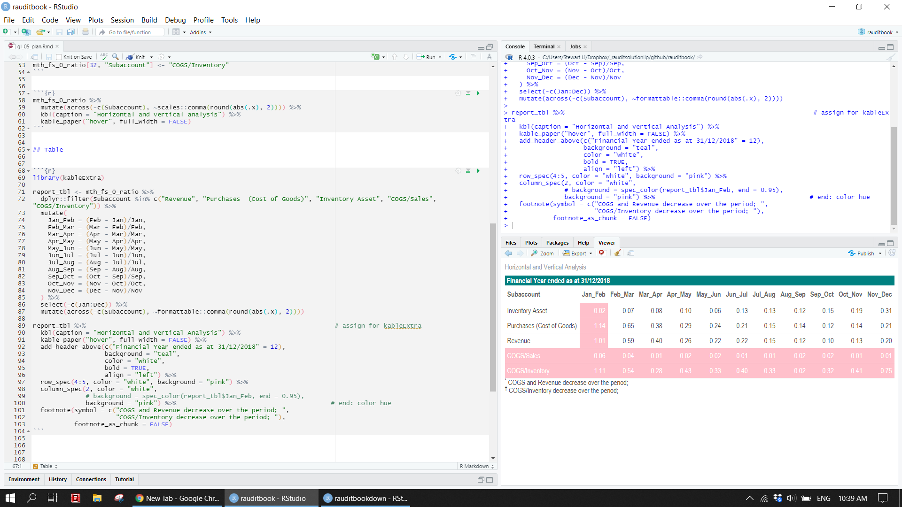
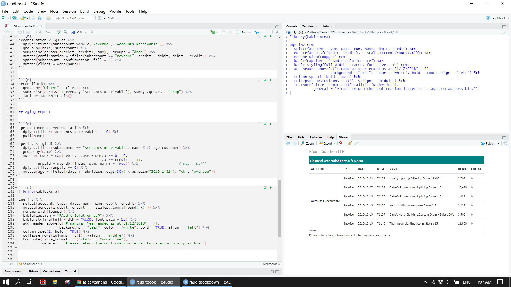
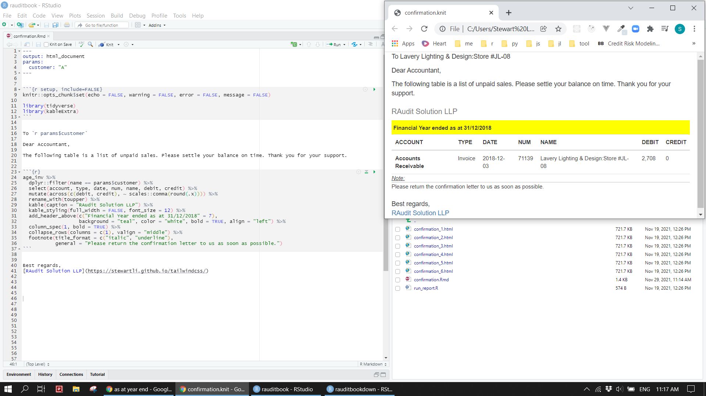
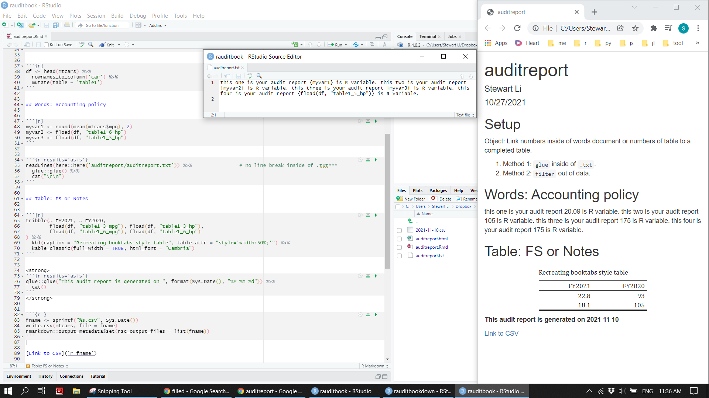

# External Auditors

This chapter is written from External Auditors perspective. Has said that, techniques can be used by other accounting professionals. External auditors usually perform audit procedures on Trial balance throughout the process from audit planning and substantive testing to reporting. Those audit procedures typically include 1) test of control; 2) identification of outlier; 3) ratios; 4) confirmation letters; 5) vouching. For illustration purpose, the audit scope is revenue and account receivables accounts. 


## Cleaning


```{r eval=FALSE}
cells <- tidyxl::xlsx_cells(here::here("data/gl_stewart.xlsx")) %>%
  dplyr::filter(!is_blank) %>%
  select(row, col, data_type, numeric, date, character)

gl <- cells %>%
  unpivotr::behead("N", "field1") %>%
  select(-col) %>%
  unpivotr::spatter(field1) %>%
  select(-row) %>%
  mutate(account = coalesce(account, bf),
         subaccount = coalesce(subaccount, account)) %>%
  fill(account, .direction = "down") %>%
  fill(subaccount, .direction = "down") %>%
  select(account, subaccount, Type, Date, Num, Adj, Name, Memo, Split, Debit, Credit, Balance) %>%
  mutate(Date = as.Date(Date, "%Y-%m-%d")) %>%
  janitor::clean_names() %>%
  replace_na(list(debit = 0, credit = 0, balance = 0))

write.csv(gl, here::here("data/gl.csv"))
```


## Validation

Remove unused column of adj. `filter` out `NA` out of column of type as they are subtotal. Transaction dates are within the range of audit period (2018-01-01, 2018-12-31). Control totals of debit and credit is same. Data dictionary and Chart of Accounts (COA) are provided.


```{r}
gl_df <- read_csv(here::here("data/gl.csv")) %>% 
  select(-1, -adj) %>% 
  dplyr::filter(!is.na(type)) %>% 
  mutate(weekday = lubridate::wday(date, label = TRUE),
         month = lubridate::month(date, label = TRUE), 
         quarter = factor(lubridate::quarter(date)))
```


```{r}
range(gl_df$date, na.rm = TRUE)
gl_df %>% select(debit, credit) %>% colSums()
```


```{r}
dd <- tibble::tribble(~Original, ~Description, ~Rename, 
        "", "Row number" , "id", 
        "account", "Charter of Accounts", "account", 
        "subaccount", "Charter of Accounts", "subaccount", 
        "type", "Invoice/Payment", "type", 
        "date", "JV posting date", "date",  
        "num", "JV number", "num",
        "adj", "JV adjustment", "adj",
        "name", "Customers/Suppliers", "name",
        "memo", "JV description", "memo",
        "split", "JV double entries", "split",
        "debit", "JV amount", "debit", 
        "credit", "JV amount", "credit", 
        "balance", "Cumulated JV amount", "balance", 
        "weekday", "Mutated variable", "weekday", 
        "month", "Mutated variable", "month", 
        "quarter", "Mutated variable", "quarter") 

dd %>% 
  DT::datatable(rownames = FALSE, options = list(paging = TRUE, pageLength = 20))
```


```{r}
library(collapsibleTree)

gl_df %>% 
  collapsibleTree(hierarchy = c("account", "subaccount", "name"),
                  width = 800,
                  zoomable = TRUE) 
```


## EDA

Columns of split and balance are left untouched. EDA of numeric is based on revenue data.


### Missing value


```{r}
gl_df %>% 
  summarise(across(everything(), ~formattable::percent(mean(is.na(.))))) %>% 
  gather()
```


```{r}
gl_df %>% visdat::vis_miss()
gl_df %>% visdat::vis_dat()
gl_df %>% naniar::gg_miss_upset()
```


### Categorical


```{r}
gl_df %>% 
  select(where(is.character)) %>% 
  map_dbl(~length(unique(.x)))
```


See to which accounts and subaccounts most of transactions in GL are posted. 


```{r eval=FALSE}
actree <- gl_df %>% 
  group_by(account, subaccount) %>% 
  summarise(n = n(), .groups = "drop")                                   

png(filename = "img/actree.png", width = 1600, height = 800)
treemap::treemap(actree,
                 index = c("account", "subaccount"),
                 vSize = "n",
                 vColor = "n",
                 type = "index", 
                 align.labels = list(c("center", "center"), c("right", "bottom")), 
                 fontface.labels = c(1, 3),
                 fontsize.labels = c(10, 8),
                 fontcolor.labels = "black",
                 title = "Charter of Accounts",                      
                 fontsize.title = 12,  
                 overlap.labels = 0.5,
                 inflate.labels = FALSE,
                 palette = "Set3",  
                 border.col = c("black", "white"),
                 border.lwds = c(2, 2)) 
dev.off()
```


```{r}

```


Prepare Trial balance and monthly financial statements out of GL, and then export them to Excel as audit working paper.


```{r}
tb <- gl_df %>% 
  group_by(subaccount) %>% 
  summarise_at(vars(debit, credit), sum)   

head(tb)
```


```{r}
mth_fs <- gl_df %>% 
  group_by(account, subaccount, month) %>%
  arrange(date) %>%                                                        
  slice(n()) %>%                                                           
  ungroup() %>% 
  select(account, subaccount, month, balance) %>% 
  pivot_wider(names_from = month, 
              values_from = balance, values_fill = 0)  

head(mth_fs)
```


```{r eval=FALSE}
library(openxlsx)

ls_df <- list("TB" = tb, "Budget" = mth_fs)
write.xlsx(ls_df, file = "supplements/accountant.xlsx")
```


```{r}

```


```{r}

```


`count` columns of type and month. `summarize` debit and credit for each type. 


```{r}
gl_df %>% count(type, sort = TRUE)

gl_df %>% 
  count(type, account, subaccount, sort = TRUE) %>% 
  slice(1:3, (n()-3):n())
```


```{r}
gl_df %>% 
  group_by(type) %>% 
  summarise(across(c(debit, credit), sum))
```


```{r}
table(gl_df$type, gl_df$month) %>% addmargins()

table(gl_df$type, gl_df$month) %>% margin.table(2)
table(gl_df$month)
```


```{r}
mytable <- table(gl_df$quarter)                                            
lbls <- paste(names(mytable), "\n", mytable, sep = "")
pie(mytable, labels = lbls, main = "Number of transactions\n (for each quarter)")
```


```{r}
mosaicplot(~ month + weekday, data = gl_df, color = TRUE, las = 1, main = NULL, xlab = "", ylab = "")
```


Perform text analysis on the column of memo in terms of PCA and correlation. 


```{r}
summary(nchar(gl_df$memo))

gl_df %>% 
  dplyr::filter(!is.na(memo), nchar(memo) > 95) %>% 
  pull(memo)
```


```{r}
library(tidytext)
library(wordcloud2)

txt <- gl_df %>% 
  tidytext::unnest_tokens(word, memo) %>% 
  anti_join(stop_words) %>% 
  dplyr::filter(!str_detect(word, "[0-9]")) 

txt %>% 
  count(word, sort = TRUE) %>% 
  wordcloud2::wordcloud2()
```


```{r}
library(widyr)

txt_pca <-  txt %>% 
  mutate(value = 1) %>% 
  widyr::widely_svd(word, name, word, nv = 6) 

txt_pca %>% 
  dplyr::filter(dimension == 1) %>% 
  arrange(desc(value))

txt_pca %>% 
  dplyr::filter(dimension == 2) %>% 
  top_n(10, abs(value)) %>% 
  mutate(word = fct_reorder(word, value)) %>%
  ggplot(aes(value, word)) +
  geom_col() 
```


```{r}
library(igraph)
library(ggraph)
library(tidygraph)

txt_cor <- txt %>% 
  add_count(word) %>% 
  dplyr::filter(n >= 50) %>%                                 
  select(name, word) %>% 
  widyr::pairwise_cor(word, name, sort = TRUE) %>%           
  dplyr::filter(correlation < 1) %>% 
  head(100)

txt_cor %>% 
  igraph::graph_from_data_frame() %>% 
  ggraph::ggraph(layout = 'kk') + 
  ggraph::geom_edge_link() +
  ggraph::geom_node_point() +
  ggraph::geom_node_text(aes(label = name), repel = TRUE) +
  theme_void() 
```


### Numberic 


```{r}
revenue <- gl_df[gl_df$subaccount == 'Revenue', ]
```


The column of credit has no debit balance in this case. But, it has 0 credit amount, which could be an error.


```{r}
sapply(revenue, function(x) length(which(x == 0)))
revenue %>% map_df(~sum(.x == 0))
revenue %>% map_df(~mean(.x == 0))
```


```{r}
revenue %>% 
  dplyr::filter(debit == 0, credit == 0)

revenue %>%
  dplyr::filter(across(c(debit, credit), ~.x == 0))
```


Analyze revenue at the level of month based on both frequency and amount. 


```{r}
# by(revenue, revenue$month, summary)
table(revenue$month) %>% prop.table()
```


```{r}
ggplot(revenue) +
  geom_bar(aes(x = factor(month), y = after_stat(count / sum(count)))) +
  scale_y_continuous(labels = scales::percent, name = "Proportion") +
  labs(x = "", y = "") +
  theme_light() 
```


```{r}
revenue %>% 
  ggplot(aes(month, credit)) +
  geom_bar(stat = 'summary', fun = "median", fill = 'steelblue') +
  geom_label(stat = "count", aes(y = ..count.., label = ..count..)) +
  scale_y_continuous(breaks = seq(0, 600, by = 100), labels = scales::comma) +
  labs(x = "", y = "") +
  theme_light()
```


```{r}
with(revenue, tapply(credit, month, function(x) {c(min(x) , max(x))}))

revenue %>% 
  group_by(month) %>% 
  arrange(desc(credit)) %>% 
  slice(c(1, n())) 
```


```{r}
revenue %>% 
  group_by(month) %>% 
  summarise(monthly_sales = sum(credit), .groups = "drop") %>% 
  mutate(accumlated_sales = cumsum(monthly_sales))
```


Analyze revenue at the level of weekday based on both frequency and amount. The result indicates a cutoff problem or possible fraud as most of transactions are posted on weekends. 
1. Frequency: Jan (Sun, Sat) 63% and Dec (Sat) 62%.
2. Amount: Jan (Sun, Sat) 51% and Dec (Sat) 46%.


```{r}
with(revenue, table(month, weekday)) %>% addmargins()
table(revenue$month, revenue$weekday) %>% prop.table(margin = 1) %>% round(2) %>% addmargins(2)

table(revenue$month, revenue$weekday) %>% margin.table(1)
table(revenue$month, revenue$weekday) %>% margin.table(2)
by(revenue$month, revenue$weekday, summary)                             
```


```{r}
revenue %>% 
  janitor::tabyl(month, weekday) %>% 
  janitor::adorn_totals() %>% 
  janitor::adorn_percentages("row") %>%                                
  janitor::adorn_pct_formatting() %>% 
  janitor::adorn_ns("front") %>% 
  janitor::adorn_title("combined") %>% 
  janitor::adorn_rounding(digits = 0)
```


```{r}
by(revenue$credit, revenue$weekday, summary)                            
psych::describeBy(revenue$credit, revenue$weekday, mat = TRUE)  
```


```{r}
xtabs(credit ~ month + weekday, revenue) %>% ftable() 
xtabs(credit ~ month + weekday, revenue) %>% ftable() %>% prop.table(margin = 1)  %>% round(2)

xtabs(credit ~ month + weekday, revenue) %>% ftable() %>% summary()     
table1::table1(~credit + weekday | quarter, data = revenue)
```


```{r}
vcd::assocstats(table(revenue$month, revenue$weekday))
kappa(table(revenue$month, revenue$weekday))
```


```{r eval=FALSE}
library(patchwork)

p1 <- revenue %>%
  mutate(weekday = fct_relevel(weekday, c("Mon", "Tue", "Wed", "Thu", "Fri", "Sat", "Sun"))) %>% 
  group_by(month, weekday) %>%
  count() %>% 
  ggplot(aes(month, weekday, fill = n)) +
  geom_tile(color = "#1D2024", size = 0.5, stat = "identity") +
  scale_fill_viridis_c(option = "B") +
  coord_equal() +
  labs(x = "", y = "")

p2 <- revenue %>%
  mutate(weekday = fct_relevel(weekday, c("Mon", "Tue", "Wed", "Thu", "Fri", "Sat", "Sun"))) %>% 
  group_by(month, weekday) %>%
  summarise(amt = sum(credit), .groups = "drop") %>% 
  ggplot(aes(month, weekday, fill = amt)) +
  geom_tile(color = "#1D2024", size = 0.5, stat = "identity") +
  scale_fill_viridis_c(option = "B", 
                       breaks = seq(10000, 30000, 10000),
                       labels = c("10K", "20K", "30K")) +
  coord_equal() +
  labs(x = "", y = "")

(p1/p2) +
  plot_layout(guide = 'collect') +
  plot_annotation(title = "The number of Journal voucher posted on weekends", 
                  caption = "RAudit Solution LLP\nhttps://stewartli.github.io/tailwindcss/") &
  theme(plot.background = element_rect(fill = "#1D2024", color = "#1D2024"),
        panel.background = element_rect(fill = "#1D2024", color = "#1D2024"),
        legend.background = element_rect(fill = "#1D2024", color = "#1D2024"),
        text = element_text(color = "#FAFAFA"),
        axis.text = element_text(color = "#FAFAFA"),
        axis.text.x = element_text(vjust = 1),
        plot.title.position = "plot", 
        title = element_text(face = "bold"), 
        panel.grid = element_blank(),
        axis.line = element_blank(),
        axis.ticks = element_blank(),
        legend.position = "right",
        legend.title = element_blank())
```


```{r}

```


Calculate statistical descriptive summary of the column of credit. Its log10 transformation is normal distribution.


```{r}
psych::describe(revenue$credit)
var(revenue$credit)

quantile(revenue$credit, probs = seq(from = 0, to = 1, by = .1), na.rm = TRUE)
IQR(revenue$credit)

summary(revenue$credit)
fivenum(revenue$credit)                                                
```


```{r}
revenue %>% 
  dplyr::filter(ntile(credit, 50) == 1)

revenue %>% 
  dplyr::filter(between(credit, 5000, 10000))
```


```{r}
set.seed(2021)

revenue %>% 
  slice_sample(prop = .9) %>% 
  summarise(sum(credit))                                                     
```


```{r}
revenue %>% 
  ggplot(aes(sample = log10(credit))) +
  geom_qq() +
  theme_light() 
```


```{r}
getPalette <- colorRampPalette(RColorBrewer::brewer.pal(8, "Set2"))(12) 
lb <- function(x) mean(x) - sd(x)
ub <- function(x) mean(x) + sd(x)

df_sum <- revenue %>% 
  group_by(quarter) %>% 
  summarise(across(credit, list(ymin = lb, ymax = ub, mean = mean)))

revenue %>% 
  ggplot(aes(factor(quarter), credit, fill = factor(quarter))) +
  geom_violin(position = position_nudge(x = .2, y = 0), trim = TRUE, alpha = .8, scale = "width") +
  geom_point(aes(y = credit, color = factor(quarter)), 
             position = position_jitter(width = .15), size = .5, alpha = 0.8) +
  geom_boxplot(width = .1, outlier.shape = NA, alpha = 0.5) +
  geom_point(data = df_sum, aes(x = quarter, y = credit_mean), 
             position = position_nudge(x = 0.3), size = 2.5) +
  geom_errorbar(data = df_sum, aes(ymin = credit_ymin, ymax = credit_ymax, y = credit_mean), 
                position = position_nudge(x = 0.3), width = 0) +
  expand_limits(x = 5.25) +
  scale_y_continuous(labels = scales::comma) +
  scale_color_manual(values = getPalette) +
  scale_fill_manual(values = getPalette) +
  theme_light() +
  theme(legend.position = "none") +
  labs(x = "", y = "")
```


```{r}
revenue %>% 
  ggplot(aes(credit, fill = factor(month))) +
  geom_histogram(bins = 50, alpha = .5) +
  geom_rug() +
  geom_vline(xintercept = 200, 
             linetype = "dashed", size = 1, color = "red", 
             show.legend = FALSE) +
  scale_x_log10(labels = scales::comma) +
  scale_fill_discrete(name = "", guide = "none") +
  annotate("text", 
           x = mean(revenue$credit) * 3.6, y = 65,
           label = paste0("Mean: $", round(mean(revenue$credit), 2))) +
  labs(x = "", y ="") +
  theme_light()
```


```{r}
revenue %>% 
  mutate(weekday = fct_relevel(weekday, rev(c("Mon", "Tue", "Wed", "Thu", "Fri", "Sat", "Sun")))) %>%
  ggplot(aes(credit, weekday)) +
  geom_boxplot(outlier.color = NA) +
  geom_jitter(shape = 16, position = position_jitter(0.4), alpha = .3) +
  stat_summary(fun = mean, geom = "point", shape = 13, size = 4, color = "firebrick") +
  scale_x_continuous(labels = scales::dollar) +
  theme_light() +
  labs(x = "", y = "")
```


```{r}
ml_mth <- revenue %>% 
  mutate(weekday = fct_relevel(weekday, rev(c("Mon", "Tue", "Wed", "Thu", "Fri", "Sat", "Sun")))) %>%
  group_by(month, weekday) %>%
  summarise(freq = n(),
            amt = sum(credit)) %>% 
  mutate(cum_freq = cumsum(freq), 
         cum_amt = cumsum(amt)) 
  
ml_mth %>% 
  ggplot(aes(amt, freq, color = amt > 10000)) +
  geom_point() +
  geom_vline(xintercept = 10000, lty = 2) +
  ggforce::geom_mark_ellipse(data = dplyr::filter(ml_mth, freq <=10, amt >= 5000, amt <= 10000), 
                             aes(description = "Watch closely"), 
                             label.fontsize = 6, 
                             label.buffer = unit(4, 'mm'), 
                             label.fill = "transparent", 
                             show.legend = FALSE) +
  scale_x_continuous(label = scales::comma) +
  scale_y_continuous(breaks = seq(0, 60, 10)) +
  scale_color_discrete(name = "Exceed", labels = c("Yes", "No"), guide = FALSE) +  
  labs(x = "Total revenue", y = "Number of transactions") +
  theme_light()
```


## Audit planning


### Test of controls

There is no gap on journal entries (JE) numbers. 


```{r}
revenue %>% 
  distinct(num, .keep_all = TRUE) %>% 
  arrange(num) %>% 
  mutate(gap = as.numeric(num) - dplyr::lag(as.numeric(num))) %>% 
  dplyr::filter(!is.na(gap), gap > 1)
```


`filter` out duplicated JE numbers. 


```{r}
revenue %>% 
  count(num, sort = TRUE) %>% 
  add_count(n)                                                            
  
revenue %>% 
  group_by(num) %>% 
  dplyr::filter(n() == 17) 
```


```{r}
revenue$num[duplicated(revenue$num)] %>% head()
```


`filter` JE numbers based on columns of date, name, and credit to perform Same same same/different (SSS/SSD) tests.


```{r}
revenue %>% 
  group_by(num, date, name, credit) %>% 
  summarise(freq = n()) %>% 
  arrange(desc(freq))

revenue %>% 
  dplyr::filter(num == "71052", credit == 210)                            
```


Assume the authority limit is 5000 and `filter` out those transactions with credit more than the limit. 


```{r}
revenue %>%
  dplyr::filter(credit > 5000)
```


### Digits tests

`filter` out transaction amount ending with 0.9 or divided by 1000.


```{r}
revenue %>% 
  dplyr::filter(near(credit - floor(credit), 0.9))                
```


```{r}
revenue %>% 
  dplyr::filter(credit %% 1000 == 0)                              
```


`filter` out same amount that appears more than 20 times.


```{r}
revenue %>% 
  group_by(credit) %>% 
  dplyr::filter(n() > 20)                                         
```


```{r}
revenue %>% 
  group_by(credit > 5000) %>% 
  summarise(across(c(credit), tibble::lst(min, max, mean, median, sum)))
```


```{r}
revenue %>% 
  group_by(credit_new = 2000 *(credit %/% 2000)) %>% 
  summarise(n = n(), total = sum(credit))
```


```{r}
revenue %>%
  count(cut_amt = cut(credit, 
                       breaks = c(-1, 1000, 5000, 10000, 20000, max(credit)),
                       labels = c("ML","1K","5K","10K", "Outlier"))) 
```


### Benford's law

The result conforms to Benford's law based on frequency.


```{r}
library(benford.analysis)

bfd.cp <- benford(revenue$credit, number.of.digits = 2, sign = "both", round = 3) 
plot(bfd.cp) 
getSuspects(bfd.cp, revenue, by = "absolute.diff", how.many = 1) %>% as_tibble()
```


```{r}
revenue %>% 
  dplyr::filter(credit >= 10) %>% 
  group_by(credit) %>% 
  summarise(freq = n()) %>% 
  arrange(desc(freq)) %>% 
  mutate(first_two = sapply(credit, function(x) substring(x, first = c(1), last = c(2)))) %>% 
  count(first_two, sort = TRUE)                                 
```


### Outlier


```{r}
revenue[which(revenue$credit %in% c(boxplot.stats(revenue$credit)$out)), ]
subset(revenue, revenue$credit %in% boxplot(revenue$credit ~ revenue$month)$out) 
```


```{r}
revenue %>% dplyr::filter(credit > quantile(credit, prob = .95))

subset(revenue, 
       revenue$credit > (quantile(revenue$credit, .25) - 1.5*IQR(revenue$credit)) & 
       revenue$credit < (quantile(revenue$credit, .75) + 1.5*IQR(revenue$credit)))
```


```{r}
revenue[which(ecdf(revenue$credit)(revenue$credit) > 0.95), ]                       
```


```{r}
revenue[which(abs(scale(revenue$credit)) > 1.96), ]                                 
```


```{r}
revenue %>% 
  mutate(z_score = scale(credit), 
         z_label = ifelse(abs(z_score - mean(z_score)) > 2*sd(z_score), "z", "ok")) %>% 
  dplyr::filter(z_label == "z") %>% 
  ggplot() +
  geom_point(aes(credit, month, size = credit > 6000), alpha = .5) +
  geom_point(aes(credit, month, color = "red")) +
  geom_vline(xintercept = 6000, lty = 2, col = "red", size = 1) +
  ggrepel::geom_text_repel(data = subset(revenue, credit > 6000),
            aes(credit, month, label = name), 
            col = "steelblue",
            size = 3) +
  scale_x_continuous(labels = scales::comma_format()) +
  scale_colour_manual(values = c("red"), guide = FALSE) +
  scale_size_manual(values = c(1, 3), guide = FALSE) +
  annotate("text", x = 6200, y = 6, label = "6,000", size = 3) +
  theme(legend.position = "none") +
  theme_minimal() + 
  labs(title = "Identification of sales outlier based on Z-score",
       x = NULL, y = NULL) 
```


### Ratios

Remove any rows containing 0 in monthly financial statements, and then perform horizontal and vertical ratio analysis. The final result is present in a formatted table.


```{r}
mth_fs[apply(mth_fs[-c(1:2)], 1, function(x) all(x != 0)), ] 

mth_fs %>% 
  rowwise() %>% 
  dplyr::filter(all(c_across(-c(account, subaccount)) != 0))
```


```{r eval=FALSE}
mth_fs_0 <- mth_fs %>% 
  select(-account) %>% 
  rowwise() %>% 
  dplyr::filter(all(c_across(-c(subaccount)) != 0)) %>% 
  column_to_rownames('subaccount') 

cogs_sales <- mth_fs_0["Purchases  (Cost of Goods)", ] / abs(mth_fs_0['Revenue', ])
inventory_cogs <- mth_fs_0["Purchases  (Cost of Goods)", ] / mth_fs_0['Inventory Asset', ]

mth_fs_0_ratio <- mth_fs_0 %>% 
  add_row(cogs_sales) %>% 
  add_row(inventory_cogs) %>% 
  rownames_to_column("Subaccount")                                     

mth_fs_0_ratio[31, "Subaccount"] <- "COGS/Sales"
mth_fs_0_ratio[32, "Subaccount"] <- "COGS/Inventory"
```


```{r eval=FALSE}
report_tbl <- mth_fs_0_ratio %>%
  dplyr::filter(
    Subaccount %in% c("Revenue", "Purchases  (Cost of Goods)", "Inventory Asset", "COGS/Sales", "COGS/Inventory")
  ) %>% 
  mutate(
    Jan_Feb = (Feb - Jan)/Jan, 
    Feb_Mar = (Mar - Feb)/Feb, 
    Mar_Apr = (Apr - Mar)/Mar, 
    Apr_May = (May - Apr)/Apr, 
    May_Jun = (Jun - May)/May, 
    Jun_Jul = (Jul - Jun)/Jun, 
    Jul_Aug = (Aug - Jul)/Jul, 
    Aug_Sep = (Sep - Aug)/Aug, 
    Sep_Oct = (Oct - Sep)/Sep, 
    Oct_Nov = (Nov - Oct)/Oct, 
    Nov_Dec = (Dec - Nov)/Nov
  ) %>% 
  select(-c(Jan:Dec)) %>% 
  mutate(across(-c(Subaccount), ~formattable::comma(round(abs(.x), 2)))) 
  
report_tbl %>%                                                                  
  kableExtra::kbl(caption = "Horizontal and Vertical Analysis") %>%
  kableExtra::kable_paper("hover", full_width = FALSE) %>% 
  kableExtra::add_header_above(c("Financial Year ended as at 31/12/2018" = 12), 
                               background = "teal", 
                               color = "white", 
                               bold = TRUE, 
                               align = "left") %>% 
  kableExtra::row_spec(4:5, color = "white", background = "pink") %>% 
  kableExtra::column_spec(2, color = "white", 
                          background = "pink") %>%                                         
  kableExtra::footnote(symbol = c("COGS and Revenue decrease over the period; ", 
                                  "COGS/Inventory decrease over the period; "),
                       footnote_as_chunk = FALSE)
```


```{r}

```


### Cutomers

Identify Top 10 customers based on total sales amount.


```{r}
revenue %>%
  count(name, wt = credit, sort = TRUE) 
```


```{r}
revenue %>% 
  mutate(name = fct_lump(name, 10, w = credit), 
         name = fct_reorder(name, credit, sum)) %>%                       
  ggplot(aes(credit, name)) + 
  geom_col() +
  scale_x_continuous(label = scales::comma) +
  labs(x = "", y = "") +
  theme_light()
```


`summarize` a table for customers, which includes how much they purchased on weekends.


```{r}
revenue %>% 
  group_by(name) %>% 
  arrange(date) %>% 
  summarise(n = n(), 
            across(credit, tibble::lst(sum, sd, mean, median, min, max, first, last)), 
            weekend_n = length(credit[weekday %in% c("Sat", "Sun")]), 
            weekend_sum = sum(credit[weekday %in% c("Sat", "Sun")]), 
            .groups = "drop") 
```


Relative size factor (RSF) compares the biggest sales to the second biggest sales.


```{r}
revenue %>% 
  group_by(name) %>% 
  arrange(desc(credit)) %>% 
  slice(1:2) %>% 
  mutate(rsf = round(credit / dplyr::lag(credit), digits = 3)) %>%       
  dplyr::filter(rsf < 0.5) 
```


```{r}
revenue %>% 
  nest(data = -c(name)) %>% 
  mutate(max_sales = map(data, ~max(.x['credit']))) %>% 
  unnest(max_sales)

revenue %>% 
  split(.$name) %>% 
  sapply(function(x) max(x$credit)) %>% 
  as.data.frame()
```


```{r}
revenue %>% 
  group_by(name) %>% 
  dplyr::filter(cumany(credit > 5000)) %>%                              
  summarise(range_credit = range(credit)) 
```


Perform the customer churn analysis and identify one time customers based on specific characteristics.


```{r}
revenue %>% 
  select(date, name, credit) %>% 
  mutate(date = lubridate::ceiling_date(date, "day")) %>% 
  group_by(name) %>% 
  mutate(revenue = sum(credit),
         last_visit = last(date),
         last_days =  as.double(as.Date("2018-12-31") - last_visit),
         orders = n()) %>% 
  select(-c(date, credit)) %>% 
  distinct(last_visit, .keep_all = TRUE) %>% 
  ggplot(aes(last_days, orders, size = revenue)) +
  geom_point() +
  geom_text(aes(label = paste0 (name, " | ", last_visit)), 
            hjust = 0, vjust = 1, 
            check_overlap = TRUE, size = 3, col = "steelblue") +
  scale_x_continuous(labels = function(x) paste0(x, "/days")) +
  scale_y_continuous(labels = function(x) paste0(x, "/orders")) +
  scale_size_continuous(name = "Revenue", labels = scales::comma_format()) +
  theme_minimal() +
  theme(legend.justification = c(1, 1),
        legend.position = c(0.95, 0.95),
        legend.background = element_blank()) +
  labs(x = "", y = "")
```


```{r}
# prcomp()
```


## Substantive test


```{r}
gl_df %>% 
  dplyr::filter(subaccount %in% c("Revenue", "Accounts Receivable")) %>% 
  group_by(subaccount, month) %>% 
  summarise_at(vars(debit, credit), sum) %>% 
  mutate(amt = case_when(subaccount == "Accounts Receivable" ~ debit - credit,
                         subaccount == "Revenue" ~ credit - debit)) %>% 
  ggplot(aes(month, amt, color = subaccount)) +
  geom_point(show.legend = FALSE) +
  geom_path(aes(group = subaccount), show.legend = FALSE) +
  geom_hline(yintercept = 0, lty = 2, col = "black", size = 1) +
  scale_y_continuous(breaks = seq(-30000, 80000, 10000), labels = scales::comma_format()) +
  theme_light() +
  labs(title = "Monthly movement for FY2018", 
       x = NULL,
       y = NULL, 
       color = "")                                                    
```


### Reconcilation

Reconcile revenue to account receivables as of year end. Ensure that sub ledger agrees to GL by check total and cross check.


```{r}
gl_df %>% 
  dplyr::filter(subaccount == "Accounts Receivable") %>% 
  summarise(across(c(debit, credit), sum), .groups = "drop")             
```


```{r}
reconcilation <- gl_df %>% 
  dplyr::filter(subaccount %in% c("Revenue", "Accounts Receivable")) %>% 
  group_by(name, subaccount) %>% 
  summarise(across(c(debit, credit), sum), .groups = "drop") %>% 
  mutate(confirmation = ifelse(subaccount == "Revenue", credit - debit, debit - credit)) %>% 
  spread(subaccount, confirmation, fill = 0) %>% 
  mutate(client = word(name))

reconcilation %>% 
  group_by("Client" = client) %>% 
  summarise(across(c(Revenue, `Accounts Receivable`), sum), .groups = "drop") %>% 
  janitor::adorn_totals()
```


### Aging report


```{r eval=FALSE}
age_customer <- reconcilation %>% 
  dplyr::filter(`Accounts Receivable` != 0) %>% 
  pull(name)

age_inv <- gl_df %>% 
  dplyr::filter(subaccount == "Accounts Receivable", name %in% age_customer) %>% 
  group_by(name) %>% 
  mutate(index = map(debit, ~case_when(.x == 0 ~ 2, 
                                       .x == credit ~ 1)), 
         unpaid = map_dbl(index, sum, na.rm = TRUE)) %>%                   
  dplyr::filter(unpaid == 0) %>% 
  mutate(age = ifelse((date + lubridate::days(30)) < as.Date("2019-1-31"), "Ok", "Overdue")) 
```


```{r eval=FALSE}
library(kableExtra)

age_inv %>% 
  select(account, type, date, num, name, debit, credit) %>% 
  mutate(across(c(debit, credit), ~ scales::comma(round(.x)))) %>% 
  rename_with(toupper) %>% 
  kable(caption = "RAudit Solution LLP") %>% 
  kable_styling(full_width = FALSE, font_size = 12) %>%
  add_header_above(c("Financial Year ended as at 31/12/2018" = 7), 
                   background = "teal", color = "white", bold = TRUE, align = "left") %>% 
  column_spec(1, bold = TRUE) %>% 
  collapse_rows(columns = c(1), valign = "middle") %>% 
  footnote(title_format = c("italic", "underline"), 
           general = "Please return the confirmation letter to us as soon as possible.")
```


```{r}

```


### Confirmation letter

Produce confirmation letters for all customers with due account receivable amount in one go. 


```{r eval=FALSE}
tibble(customer = unique(age_inv$name),
       filename = here::here(paste0("confirmation/", "confirmation_", seq(length(unique(age_inv$name))), ".html")),
       params = map(customer, ~ list(customer = .))) %>% 
  select(output_file = filename, params) %>% 
  pwalk(rmarkdown::render, input = here::here("confirmation/confirmation.Rmd"), "html_document", envir = new.env())


paste0("confirmation/", list.files(here::here("confirmation"), "*.html")) %>% 
  map(file.remove)
```


```{r}

```


## Reporting


Audit report needs to be filled up with numbers after finalized draft financial statements.  


```{r eval=FALSE}
fload <- function(df, cell){
  pos <- strsplit(cell, split = '_') %>% unlist() 
  df %>% 
    dplyr::filter(table == pos[1], row_number() == pos[2]) %>% 
    select(pos[3]) %>% 
    pull()
}
```


```{r eval=FALSE}
df <- head(mtcars) %>% 
  rownames_to_column('car') %>% 
  mutate(table = 'table1')                                              
```


```{r}

```


