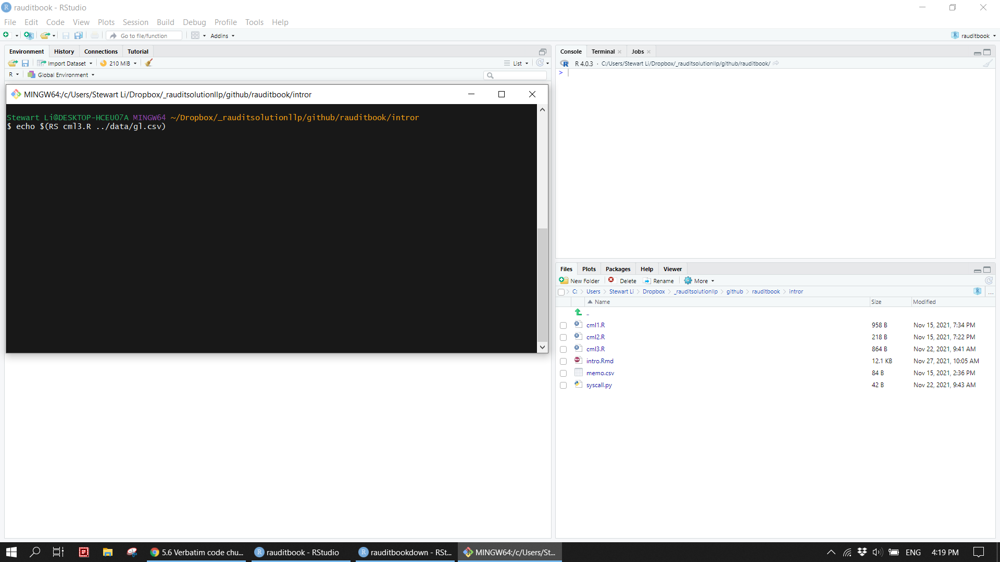
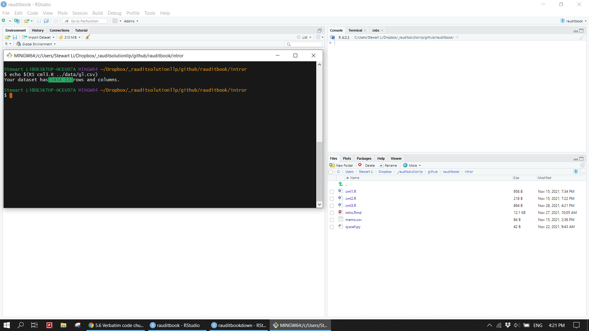
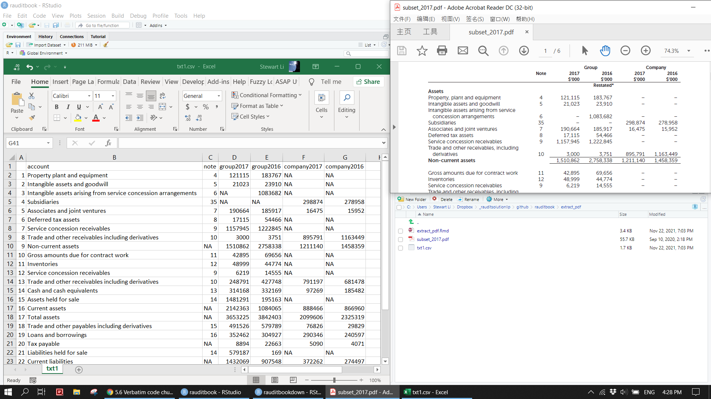
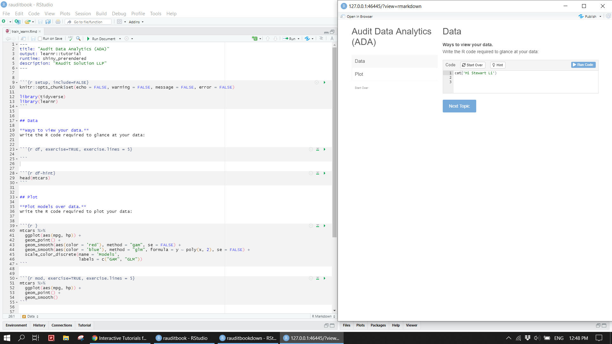
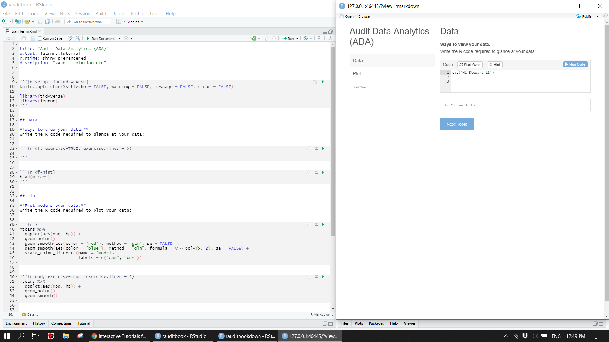
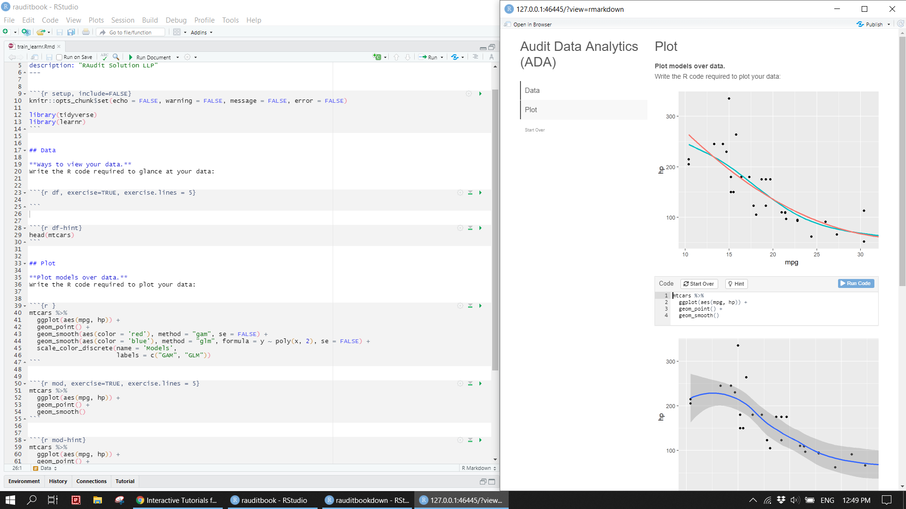

# Utilities


## Command line tool

Write and run a R script on a terminal. 


```{r eval=FALSE}
st_cml <- function(df){
  cat(paste0("Your dataset has", 
             '\x1b[6;30;42m', "[", dim(df)[1], " ", dim(df)[2], "]", '\x1b[0m',
             "rows and columns", ".\n"))
}

main <- function() {
  args <- commandArgs(trailingOnly = TRUE)
  f <- args[1]
  stopifnot("Please specificy a csv file" = length(f) == 1)
  stopifnot("Please specificy a csv file" = tools::file_ext("data/gl.csv") == "csv")
  st_cml(read.csv(file = f))
}

main()
```


```{r}

```


```{r}

```


## PDF data

Data inside of PDF documents can be extracted via `pdftools`. Data inside of a website can be pulled out via `rvest`. Web scrapping is not covered here. For a detailed example, refer to [Listed companies in Singapore](https://rpubs.com/Stewartli/518397). 


```{r eval=FALSE}
txt <- pdftools::pdf_text(here::here("suppliments/subset_2017.pdf"))

txt1 <- txt[1] %>% 
  str_split("\n") %>% 
  unlist()
```


```{r eval=FALSE}
txt1_start <- stringr::str_which(txt1, "Property, plant and equipment")
txt1_end <- stringr::str_which(txt1, "Net assets")

txt1_raw <- txt1[txt1_start:txt1_end] %>% 
  str_trim() %>% 
  str_replace_all("\\s{2,}", "|") %>%                                     
  str_remove_all(",") %>% 
  enframe() %>% 
  separate(value, 
           into = c("account", "note", "group2017", "group2016", "company2017", "company2016"), 
           sep = "\\|", extra = "merge", fill = "right") %>% 
  dplyr::filter(!str_detect(account, "[0-9]")) %>% 
  dplyr::filter(!account %in% c("Intangible assets arising from service", 
                                "Trade and other receivables including", 
                                "Liabilities", 
                                "Trade and other payables including")) %>% 
  mutate(account = case_when(
    account == "concession arrangements" ~ "Intangible assets arising from service concession arrangements", 
    account == 'derivatives' & group2017 == 3000 ~ "Trade and other receivables including derivatives", 
    account == 'derivatives' & group2017 == 248791 ~ "Trade and other receivables including derivatives", 
    account == 'derivatives' & group2017 == 491526 ~ "Trade and other payables including derivatives", 
    account == 'derivatives' & group2017 == 35895 ~ "Trade and other payables including derivatives", 
    TRUE ~ account)) 
```


```{r eval=FALSE}
txt1_raw[txt1_raw$account == "Non-current assets", ][3:ncol(txt1_raw)] <- txt1_raw[txt1_raw$account == "Non-current assets", ][2:(ncol(txt1_raw)-1)]

txt1_raw[txt1_raw$account == "Current assets", ][3:ncol(txt1_raw)] <- txt1_raw[txt1_raw$account == "Current assets", ][2:(ncol(txt1_raw)-1)]

txt1_raw[txt1_raw$account == "Total assets", ][3:ncol(txt1_raw)] <- txt1_raw[txt1_raw$account == "Total assets", ][2:(ncol(txt1_raw)-1)]

txt1_raw[txt1_raw$account == "Current liabilities", ][3:ncol(txt1_raw)] <- txt1_raw[txt1_raw$account == "Current liabilities", ][2:(ncol(txt1_raw)-1)]

txt1_raw[txt1_raw$account == "Net current assets", ][3:ncol(txt1_raw)] <- txt1_raw[txt1_raw$account == "Net current assets", ][2:(ncol(txt1_raw)-1)]

txt1_raw[txt1_raw$account == "Non-current liabilities", ][3:ncol(txt1_raw)] <- txt1_raw[txt1_raw$account == "Non-current liabilities", ][2:(ncol(txt1_raw)-1)]

txt1_raw[txt1_raw$account == "Net assets", ][3:ncol(txt1_raw)] <- txt1_raw[txt1_raw$account == "Net assets", ][2:(ncol(txt1_raw)-1)]

txt1_raw[txt1_raw$account == "Tax payable", ][3:ncol(txt1_raw)] <- txt1_raw[txt1_raw$account == "Tax payable", ][2:(ncol(txt1_raw)-1)]
```


```{r eval=FALSE}
txt1_clean <- txt1_raw %>% 
  select(-name) %>% 
  mutate(across(-c(account), readr::parse_number))

write.csv(txt1_clean, here::here("suppliments/txt1.csv"))
```


```{r}

```


## Learnr

You can easily make a interactive training materials to facilitate new staffs to get off the ground as quickly as possible.


```{r}

```


```{r}

```


```{r}

```


